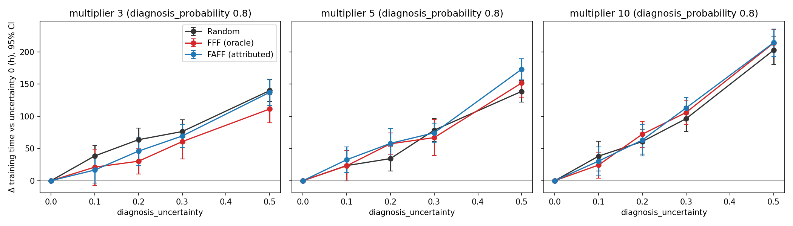

# Does Diagnosis Uncertainty Matter at Realistic Parameters?

**Configuration:** `config.yaml` (DSN'26 Table I defaults) with only `diagnosis_uncertainty`, the systematic-failure multiplier and `diagnosis_probability` varied; `NeverRemove` throughout. Δ is training time minus the same policy's uncertainty-0 training time (positive = slower).

**Pre-registered criterion:** "Misattribution matters at realistic parameters" if, for Random + NeverRemove at multiplier 5, uncertainty ≤ 0.2 raises mean training time by ≥ 1% with a 95% CI excluding zero (tested at diagnosis_probability 0.8, uncertainty 0.2; uncertainty 0.1 and the probability-1.0 slice are reported but do not decide the verdict).

## Verdict

**Misattribution matters at realistic parameters: NO (pre-registered criterion).** For Random + NeverRemove at multiplier 5 and diagnosis_probability 0.8, uncertainty 0.2 changes mean training time by +36.5 h (+0.37%; 95% CI +0.15% to +0.58%), and uncertainty 0.1 by +20.5 h (+0.21%; 95% CI -0.03% to +0.45%); the criterion required a rise of at least 1% with a CI excluding zero.

The effect is nonetheless small but detectable, and it grows with uncertainty: for Random at uncertainty 0.5 (outside the pre-registered range) training time rises +2.07% (95% CI +1.76% to +2.38%) at multiplier 5 and +2.36% (+2.17% to +2.55%) at multiplier 10.

Whether FewestAttributedFailuresFirst retains the benefit of oracle FFF is moot here: oracle FFF shows no measurable benefit over Random even at uncertainty 0 (paired 95% CIs include 0 at all three multipliers; a benefit larger than 18 h, about 0.2% of training time, is excluded). Across all 59 paired policy contrasts in §4, 1 has a 95% CI excluding zero (about 3 expected by chance, no multiplicity adjustment).

This null result is not because the scheduling policy is rarely consulted. `Scheduler.do_host_selection` re-picks the *entire* job (`job_size + warm_standbys`) from the available pool every time it runs -- it happened 37.7 times per run here (range 25–53) -- so one full selection can bench every server the policy currently regards as bad, up to the pool's headroom (`working_pool_size - job_size - warm_standbys`). Between full selections, `Scheduler.swap_in_standby` replaces a failed active server with the oldest warm standby, FIFO, without consulting the policy; a full selection is re-triggered only once standbys run out. At these parameters headroom is 48 servers against an initial bad population of ~624 (15% of the pool) -- only 7.7% of the bad population can be excluded even by a perfectly policy-aware selection, and that population shrinks further as the run progresses and repairs cure it out (`SIMULATION_REPORT.md` §5a). Both bound the benefit independent of how often full selection happens. The data agree: time-averaged faulty servers in the active job are statistically indistinguishable between oracle FFF (60.4) and Random (60.5) at these parameters. Contrast the stress regime (`SCHEDULING_COMPARISON_REPORT.md`), where headroom (488 servers) exceeds the entire initial bad population (~368) and FewestFailuresFirst visibly benches bad servers (faulty-in-active time-average 129.7 vs Random's 170.9, saving ~272 h) -- confirming the mechanism works when headroom allows it, and that its absence here, not rare consultation, is why FFF and FAFF show no benefit at these parameters. FewestAttributedFailuresFirst has not been tested in the stress regime.

The misattribution cost is an accounting consequence of extra failures. In AIReSim, training time is exactly job_length + failures × recovery_time + host selections × host_selection_time + preemptions × preemption_wait_time (largest residual over all runs 1.2e-10 h; §6). Misattribution leaves faulty servers unrepaired, they fail again, and each extra failure costs one recovery. The model charges no lost work since the last checkpoint, so a failure's cost does not depend on when it occurs.

---

## 1. Provenance

- Results: `examples/diagnosis_realistic_figures/results.csv` (1200 rows), generated by `examples/diagnosis_realistic_sweep.py` at commit(s) `0cab8fbdf4`; this report is generated by `examples/diagnosis_realistic_report.py` from that CSV only.
- N_REPS = 20 per cell/policy, seeds 42..61 (same seed set for every cell and policy), all with `NeverRemove`; full `Params` are stored per row.
- Cells with fewer replications than N_REPS: 0.

## 2. Sanity check (`sanity.csv`)

Random + NeverRemove, `config.yaml` defaults, uncertainty 0, seeds 42-71 (30 replications). `SIMULATION_REPORT.md` reports 9,872.90 h at probability 1.0, and these rows are bit-identical to the golden values in `tests/data/prefix_golden.json`.

| diagnosis_probability | n | mean (h) | 95% CI half-width (h) |
|---|---|---|---|
| 1.0 | 30 | 9872.8967 | 12.87 |
| 0.8 | 30 | 9924.8872 | 14.69 |

## 3. Results

Δ = mean paired difference vs the uncertainty-0 cell of the same policy (hours; % of that cell's mean). `misattr.` = repairs sent to a server that did not actually fail; `non-faulty` = repairs submitted for a server with `is_bad == False` (includes ordinary random failures); `faulty pool`/`faulty active` = time-averaged number of `is_bad` servers in the working pool / in the active job, sampled every 360 simulated minutes.

### diagnosis_probability = 0.8, multiplier = 3

| policy | unc | mean (h) ± 95% CI | Δ vs unc 0 (h) ± 95% CI | Δ % | ETR | syst. fail. | misattr. | non-faulty | faulty pool | faulty active |
|---|---|---|---|---|---|---|---|---|---|---|
| Random | 0.0 | 9887.7 ± 12.4 | — | — | 0.6214 | 773 | 0 | 8147 | 105.4 | 104.6 |
| Random | 0.1 | 9914.6 ± 15.6 | +26.8 ± 20.1 | +0.27% | 0.6197 | 830 | 899 | 8220 | 116.0 | 115.2 |
| Random | 0.2 | 9934.7 ± 13.0 | +46.9 ± 17.8 | +0.47% | 0.6184 | 896 | 1834 | 8269 | 124.0 | 123.1 |
| Random | 0.3 | 9962.7 ± 16.7 | +75.0 ± 23.2 | +0.76% | 0.6167 | 957 | 2734 | 8348 | 132.3 | 131.4 |
| Random | 0.5 | 10017.8 ± 17.9 | +130.1 ± 22.3 | +1.32% | 0.6133 | 1145 | 4609 | 8478 | 156.5 | 155.5 |
| FFF (oracle) | 0.0 | 9894.2 ± 18.2 | — | — | 0.6210 | 764 | 0 | 8185 | 107.5 | 106.5 |
| FFF (oracle) | 0.1 | 9922.7 ± 16.3 | +28.4 ± 25.7 | +0.29% | 0.6192 | 825 | 901 | 8239 | 113.7 | 112.5 |
| FFF (oracle) | 0.2 | 9939.8 ± 15.8 | +45.6 ± 22.8 | +0.46% | 0.6181 | 891 | 1805 | 8281 | 123.7 | 122.3 |
| FFF (oracle) | 0.3 | 9951.6 ± 13.3 | +57.4 ± 21.1 | +0.58% | 0.6174 | 966 | 2744 | 8326 | 132.9 | 131.1 |
| FFF (oracle) | 0.5 | 10011.0 ± 16.2 | +116.7 ± 22.5 | +1.18% | 0.6137 | 1149 | 4639 | 8470 | 160.1 | 156.7 |
| FAFF (attributed) | 0.0 | 9895.3 ± 13.3 | — | — | 0.6209 | 764 | 0 | 8162 | 105.3 | 104.5 |
| FAFF (attributed) | 0.1 | 9905.2 ± 14.7 | +10.0 ± 22.3 | +0.10% | 0.6203 | 825 | 908 | 8196 | 114.8 | 114.0 |
| FAFF (attributed) | 0.2 | 9936.5 ± 16.1 | +41.2 ± 22.2 | +0.42% | 0.6183 | 889 | 1795 | 8259 | 123.4 | 122.5 |
| FAFF (attributed) | 0.3 | 9960.8 ± 18.3 | +65.5 ± 24.0 | +0.66% | 0.6168 | 964 | 2774 | 8340 | 132.8 | 131.9 |
| FAFF (attributed) | 0.5 | 10028.7 ± 13.4 | +133.4 ± 19.5 | +1.35% | 0.6126 | 1152 | 4655 | 8495 | 157.9 | 157.1 |

### diagnosis_probability = 0.8, multiplier = 5

| policy | unc | mean (h) ± 95% CI | Δ vs unc 0 (h) ± 95% CI | Δ % | ETR | syst. fail. | misattr. | non-faulty | faulty pool | faulty active |
|---|---|---|---|---|---|---|---|---|---|---|
| Random | 0.0 | 9922.5 ± 16.9 | — | — | 0.6192 | 871 | 0 | 8218 | 75.3 | 74.6 |
| Random | 0.1 | 9943.0 ± 12.6 | +20.5 ± 23.9 | +0.21% | 0.6179 | 913 | 902 | 8291 | 79.5 | 78.8 |
| Random | 0.2 | 9959.1 ± 18.3 | +36.5 ± 21.3 | +0.37% | 0.6169 | 1005 | 1827 | 8328 | 87.7 | 87.0 |
| Random | 0.3 | 10006.6 ± 18.0 | +84.1 ± 26.2 | +0.85% | 0.6140 | 1114 | 2770 | 8434 | 96.3 | 95.5 |
| Random | 0.5 | 10127.9 ± 19.9 | +205.4 ± 30.3 | +2.07% | 0.6067 | 1400 | 4779 | 8733 | 120.0 | 119.1 |
| FFF (oracle) | 0.0 | 9935.4 ± 10.4 | — | — | 0.6184 | 862 | 0 | 8270 | 75.3 | 74.2 |
| FFF (oracle) | 0.1 | 9945.5 ± 13.0 | +10.2 ± 15.9 | +0.10% | 0.6178 | 926 | 909 | 8294 | 81.3 | 80.0 |
| FFF (oracle) | 0.2 | 9981.8 ± 15.2 | +46.4 ± 19.8 | +0.47% | 0.6155 | 1003 | 1835 | 8384 | 87.3 | 85.6 |
| FFF (oracle) | 0.3 | 10009.6 ± 15.0 | +74.3 ± 21.1 | +0.75% | 0.6138 | 1102 | 2790 | 8442 | 96.5 | 94.4 |
| FFF (oracle) | 0.5 | 10108.6 ± 15.9 | +173.3 ± 16.6 | +1.74% | 0.6078 | 1379 | 4758 | 8701 | 119.6 | 116.5 |
| FAFF (attributed) | 0.0 | 9922.5 ± 16.0 | — | — | 0.6192 | 864 | 0 | 8230 | 75.2 | 74.4 |
| FAFF (attributed) | 0.1 | 9942.4 ± 16.3 | +19.9 ± 25.1 | +0.20% | 0.6180 | 918 | 909 | 8294 | 79.8 | 79.0 |
| FAFF (attributed) | 0.2 | 9973.8 ± 19.2 | +51.3 ± 22.8 | +0.52% | 0.6160 | 1011 | 1831 | 8361 | 87.6 | 86.8 |
| FAFF (attributed) | 0.3 | 10007.7 ± 16.9 | +85.2 ± 26.5 | +0.86% | 0.6139 | 1116 | 2784 | 8436 | 96.2 | 95.4 |
| FAFF (attributed) | 0.5 | 10094.4 ± 16.3 | +171.9 ± 19.7 | +1.73% | 0.6087 | 1386 | 4745 | 8647 | 117.4 | 116.6 |

### diagnosis_probability = 0.8, multiplier = 10

| policy | unc | mean (h) ± 95% CI | Δ vs unc 0 (h) ± 95% CI | Δ % | ETR | syst. fail. | misattr. | non-faulty | faulty pool | faulty active |
|---|---|---|---|---|---|---|---|---|---|---|
| Random | 0.0 | 9947.6 ± 14.1 | — | — | 0.6176 | 940 | 0 | 8291 | 46.2 | 45.6 |
| Random | 0.1 | 9987.7 ± 18.4 | +40.0 ± 23.5 | +0.40% | 0.6152 | 1008 | 912 | 8394 | 49.3 | 48.7 |
| Random | 0.2 | 10013.5 ± 15.7 | +65.9 ± 15.9 | +0.66% | 0.6136 | 1133 | 1858 | 8463 | 54.5 | 53.8 |
| Random | 0.3 | 10049.7 ± 17.6 | +102.0 ± 24.3 | +1.03% | 0.6114 | 1246 | 2802 | 8539 | 61.0 | 60.2 |
| Random | 0.5 | 10182.5 ± 18.7 | +234.8 ± 19.0 | +2.36% | 0.6034 | 1621 | 4836 | 8861 | 77.0 | 76.2 |
| FFF (oracle) | 0.0 | 9948.9 ± 11.8 | — | — | 0.6176 | 931 | 0 | 8306 | 46.9 | 45.4 |
| FFF (oracle) | 0.1 | 9987.3 ± 18.0 | +38.4 ± 20.6 | +0.39% | 0.6152 | 1017 | 914 | 8392 | 51.4 | 49.1 |
| FFF (oracle) | 0.2 | 10023.0 ± 18.9 | +74.1 ± 24.0 | +0.74% | 0.6130 | 1117 | 1857 | 8469 | 56.6 | 53.5 |
| FFF (oracle) | 0.3 | 10055.6 ± 17.6 | +106.7 ± 24.0 | +1.07% | 0.6110 | 1238 | 2808 | 8552 | 63.1 | 58.5 |
| FFF (oracle) | 0.5 | 10176.8 ± 16.9 | +227.9 ± 22.0 | +2.29% | 0.6037 | 1606 | 4820 | 8849 | 80.8 | 75.4 |
| FAFF (attributed) | 0.0 | 9964.1 ± 16.8 | — | — | 0.6166 | 924 | 0 | 8335 | 46.0 | 45.1 |
| FAFF (attributed) | 0.1 | 9975.9 ± 16.9 | +11.8 ± 24.2 | +0.12% | 0.6159 | 1018 | 923 | 8365 | 50.2 | 49.3 |
| FAFF (attributed) | 0.2 | 10025.5 ± 19.6 | +61.4 ± 27.4 | +0.62% | 0.6128 | 1134 | 1858 | 8476 | 55.3 | 54.5 |
| FAFF (attributed) | 0.3 | 10051.7 ± 18.0 | +87.5 ± 27.9 | +0.88% | 0.6113 | 1233 | 2804 | 8553 | 60.2 | 59.4 |
| FAFF (attributed) | 0.5 | 10184.3 ± 23.3 | +220.1 ± 24.2 | +2.21% | 0.6033 | 1610 | 4836 | 8860 | 77.0 | 76.1 |

### diagnosis_probability = 1.0, multiplier = 5

| policy | unc | mean (h) ± 95% CI | Δ vs unc 0 (h) ± 95% CI | Δ % | ETR | syst. fail. | misattr. | non-faulty | faulty pool | faulty active |
|---|---|---|---|---|---|---|---|---|---|---|
| Random | 0.0 | 9878.8 ± 17.3 | — | — | 0.6219 | 687 | 0 | 10366 | 60.8 | 60.5 |
| Random | 0.1 | 9881.2 ± 15.5 | +2.3 ± 25.4 | +0.02% | 0.6218 | 742 | 1116 | 10377 | 64.7 | 64.4 |
| Random | 0.2 | 9914.1 ± 15.1 | +35.3 ± 19.9 | +0.36% | 0.6197 | 810 | 2267 | 10471 | 70.7 | 70.4 |
| Random | 0.3 | 9934.7 ± 23.1 | +55.9 ± 23.0 | +0.57% | 0.6185 | 894 | 3409 | 10533 | 77.3 | 76.9 |
| Random | 0.5 | 10022.8 ± 19.4 | +144.0 ± 20.2 | +1.46% | 0.6130 | 1112 | 5807 | 10797 | 95.0 | 94.6 |
| FFF (oracle) | 0.0 | 9872.0 ± 13.3 | — | — | 0.6224 | 687 | 0 | 10343 | 60.8 | 60.4 |
| FFF (oracle) | 0.1 | 9882.3 ± 12.4 | +10.3 ± 18.3 | +0.10% | 0.6217 | 750 | 1110 | 10368 | 65.2 | 64.6 |
| FFF (oracle) | 0.2 | 9916.4 ± 16.0 | +44.4 ± 21.0 | +0.45% | 0.6196 | 809 | 2254 | 10476 | 71.2 | 70.4 |
| FFF (oracle) | 0.3 | 9942.5 ± 13.6 | +70.5 ± 20.7 | +0.71% | 0.6180 | 899 | 3391 | 10551 | 80.6 | 79.1 |
| FFF (oracle) | 0.5 | 10026.4 ± 18.7 | +154.4 ± 24.9 | +1.56% | 0.6128 | 1113 | 5809 | 10803 | 98.9 | 95.6 |
| FAFF (attributed) | 0.0 | 9872.0 ± 13.3 | — | — | 0.6224 | 687 | 0 | 10343 | 60.8 | 60.4 |
| FAFF (attributed) | 0.1 | 9899.0 ± 20.0 | +27.0 ± 21.4 | +0.27% | 0.6207 | 738 | 1127 | 10424 | 65.0 | 64.7 |
| FAFF (attributed) | 0.2 | 9919.0 ± 13.6 | +47.0 ± 21.9 | +0.48% | 0.6194 | 801 | 2256 | 10488 | 70.3 | 69.9 |
| FAFF (attributed) | 0.3 | 9944.2 ± 15.6 | +72.2 ± 18.1 | +0.73% | 0.6179 | 887 | 3408 | 10562 | 77.7 | 77.3 |
| FAFF (attributed) | 0.5 | 10017.5 ± 14.9 | +145.6 ± 17.0 | +1.47% | 0.6133 | 1105 | 5810 | 10778 | 95.0 | 94.6 |

## 4. Policy contrasts (paired by seed, hours, negative = first policy faster)

| prob | mult | unc | FFF − Random | FAFF − Random | FAFF − FFF |
|---|---|---|---|---|---|
| 0.8 | 3 | 0.0 | +6.5 ± 24.9 | +7.5 ± 20.6 | +1.0 ± 20.2 |
| 0.8 | 3 | 0.1 | +8.1 ± 21.8 | -9.3 ± 20.9 | -17.4 ± 17.8 |
| 0.8 | 3 | 0.2 | +5.1 ± 23.2 | +1.8 ± 24.2 | -3.3 ± 22.1 |
| 0.8 | 3 | 0.3 | -11.1 ± 22.7 | -1.9 ± 24.0 | +9.2 ± 20.2 |
| 0.8 | 3 | 0.5 | -6.9 ± 26.4 | +10.8 ± 21.6 | +17.7 ± 21.8 |
| 0.8 | 5 | 0.0 | +12.8 ± 21.6 | -0.0 ± 19.8 | -12.9 ± 21.0 |
| 0.8 | 5 | 0.1 | +2.5 ± 18.5 | -0.6 ± 17.7 | -3.1 ± 18.1 |
| 0.8 | 5 | 0.2 | +22.7 ± 24.6 | +14.7 ± 25.4 | -8.0 ± 27.2 |
| 0.8 | 5 | 0.3 | +3.0 ± 21.5 | +1.1 ± 22.6 | -1.9 ± 23.7 |
| 0.8 | 5 | 0.5 | -19.2 ± 26.5 | -33.5 ± 28.2 | -14.2 ± 21.8 |
| 0.8 | 10 | 0.0 | +1.3 ± 16.9 | +16.5 ± 19.4 | +15.2 ± 21.8 |
| 0.8 | 10 | 0.1 | -0.3 ± 25.0 | -11.8 ± 22.1 | -11.4 ± 23.7 |
| 0.8 | 10 | 0.2 | +9.4 ± 22.7 | +12.0 ± 27.2 | +2.5 ± 32.0 |
| 0.8 | 10 | 0.3 | +5.9 ± 22.4 | +2.0 ± 24.9 | -3.9 ± 28.1 |
| 0.8 | 10 | 0.5 | -5.6 ± 20.9 | +1.8 ± 26.0 | +7.4 ± 27.0 |
| 1.0 | 5 | 0.0 | -6.8 ± 23.3 | -6.8 ± 23.3 | +0.0 ± 0.0 |
| 1.0 | 5 | 0.1 | +1.1 ± 23.7 | +17.9 ± 27.8 | +16.8 ± 20.4 |
| 1.0 | 5 | 0.2 | +2.3 ± 20.1 | +4.9 ± 22.3 | +2.6 ± 18.9 |
| 1.0 | 5 | 0.3 | +7.7 ± 25.4 | +9.5 ± 30.0 | +1.7 ± 22.1 |
| 1.0 | 5 | 0.5 | +3.6 ± 27.6 | -5.3 ± 27.8 | -8.9 ± 26.1 |

## 5. Pairing

All components share one RNG, and `rng.random() < diagnosis_uncertainty` is only drawn when uncertainty > 0, so runs with the same seed diverge at the first failure (and Random vs FFF at the first host selection). Only the initial bad-server layout is shared. Mean seed-wise correlation between an uncertainty-u run and its uncertainty-0 counterpart: -0.01 (n = 48 comparisons), i.e. pairing gives essentially no variance reduction; the paired-t intervals are valid but not tighter than unpaired ones.

## 6. Accounting identity

In every run, training time equals job_length + total_failures × recovery_time + host_selection_count × host_selection_time + preemption_count × preemption_wait_time (there are no job stalls in this sweep). AIReSim charges exactly one `recovery_time` per failure and no lost work since the last checkpoint. Any effect of diagnosis quality or policy on training time is therefore exactly its effect on the number of failures.

Maximum absolute residual of that identity over all 1200 runs: 1.16e-10 h.

| prob | mult | policy | unc | Δ time (h) | Δ failures | Δ failures × recovery (h) |
|---|---|---|---|---|---|---|
| 0.8 | 3 | Random | 0.1 | +26.8 | +80.2 | +26.7 |
| 0.8 | 3 | Random | 0.2 | +46.9 | +139.4 | +46.5 |
| 0.8 | 3 | Random | 0.3 | +75.0 | +223.4 | +74.5 |
| 0.8 | 3 | Random | 0.5 | +130.1 | +389.9 | +130.0 |
| 0.8 | 3 | FFF (oracle) | 0.1 | +28.4 | +85.3 | +28.4 |
| 0.8 | 3 | FFF (oracle) | 0.2 | +45.6 | +136.6 | +45.5 |
| 0.8 | 3 | FFF (oracle) | 0.3 | +57.4 | +172.2 | +57.4 |
| 0.8 | 3 | FFF (oracle) | 0.5 | +116.7 | +349.0 | +116.3 |
| 0.8 | 3 | FAFF (attributed) | 0.1 | +10.0 | +30.4 | +10.1 |
| 0.8 | 3 | FAFF (attributed) | 0.2 | +41.2 | +123.2 | +41.0 |
| 0.8 | 3 | FAFF (attributed) | 0.3 | +65.5 | +196.9 | +65.6 |
| 0.8 | 3 | FAFF (attributed) | 0.5 | +133.4 | +399.8 | +133.3 |
| 0.8 | 5 | Random | 0.1 | +20.5 | +62.2 | +20.8 |
| 0.8 | 5 | Random | 0.2 | +36.5 | +111.0 | +37.0 |
| 0.8 | 5 | Random | 0.3 | +84.1 | +252.3 | +84.1 |
| 0.8 | 5 | Random | 0.5 | +205.4 | +616.6 | +205.5 |
| 0.8 | 5 | FFF (oracle) | 0.1 | +10.2 | +31.2 | +10.4 |
| 0.8 | 5 | FFF (oracle) | 0.2 | +46.4 | +139.7 | +46.6 |
| 0.8 | 5 | FFF (oracle) | 0.3 | +74.3 | +223.3 | +74.5 |
| 0.8 | 5 | FFF (oracle) | 0.5 | +173.3 | +520.1 | +173.4 |
| 0.8 | 5 | FAFF (attributed) | 0.1 | +19.9 | +59.6 | +19.9 |
| 0.8 | 5 | FAFF (attributed) | 0.2 | +51.3 | +152.7 | +50.9 |
| 0.8 | 5 | FAFF (attributed) | 0.3 | +85.2 | +256.9 | +85.7 |
| 0.8 | 5 | FAFF (attributed) | 0.5 | +171.9 | +516.3 | +172.1 |
| 0.8 | 10 | Random | 0.1 | +40.0 | +120.9 | +40.3 |
| 0.8 | 10 | Random | 0.2 | +65.9 | +196.3 | +65.4 |
| 0.8 | 10 | Random | 0.3 | +102.0 | +304.6 | +101.5 |
| 0.8 | 10 | Random | 0.5 | +234.8 | +702.7 | +234.2 |
| 0.8 | 10 | FFF (oracle) | 0.1 | +38.4 | +114.2 | +38.0 |
| 0.8 | 10 | FFF (oracle) | 0.2 | +74.1 | +221.2 | +73.8 |
| 0.8 | 10 | FFF (oracle) | 0.3 | +106.7 | +315.1 | +105.0 |
| 0.8 | 10 | FFF (oracle) | 0.5 | +227.9 | +683.2 | +227.8 |
| 0.8 | 10 | FAFF (attributed) | 0.1 | +11.8 | +35.0 | +11.7 |
| 0.8 | 10 | FAFF (attributed) | 0.2 | +61.4 | +188.3 | +62.8 |
| 0.8 | 10 | FAFF (attributed) | 0.3 | +87.5 | +264.0 | +88.0 |
| 0.8 | 10 | FAFF (attributed) | 0.5 | +220.1 | +657.9 | +219.3 |
| 1.0 | 5 | Random | 0.1 | +2.3 | +7.5 | +2.5 |
| 1.0 | 5 | Random | 0.2 | +35.3 | +105.9 | +35.3 |
| 1.0 | 5 | Random | 0.3 | +55.9 | +166.4 | +55.5 |
| 1.0 | 5 | Random | 0.5 | +144.0 | +432.1 | +144.0 |
| 1.0 | 5 | FFF (oracle) | 0.1 | +10.3 | +30.4 | +10.1 |
| 1.0 | 5 | FFF (oracle) | 0.2 | +44.4 | +131.8 | +43.9 |
| 1.0 | 5 | FFF (oracle) | 0.3 | +70.5 | +210.8 | +70.3 |
| 1.0 | 5 | FFF (oracle) | 0.5 | +154.4 | +460.1 | +153.4 |
| 1.0 | 5 | FAFF (attributed) | 0.1 | +27.0 | +80.2 | +26.8 |
| 1.0 | 5 | FAFF (attributed) | 0.2 | +47.0 | +139.6 | +46.5 |
| 1.0 | 5 | FAFF (attributed) | 0.3 | +72.2 | +215.4 | +71.8 |
| 1.0 | 5 | FAFF (attributed) | 0.5 | +145.6 | +433.5 | +144.5 |

The two columns differ only by the host-selection and preemption-wait terms (a few minutes each).

## Figure

