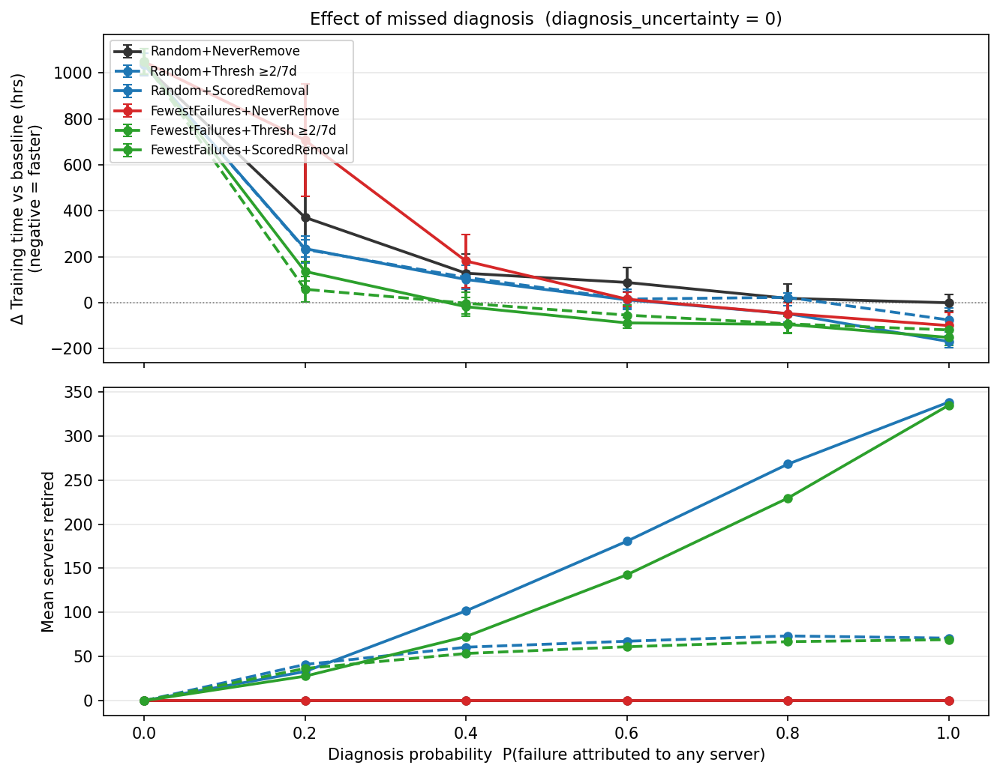
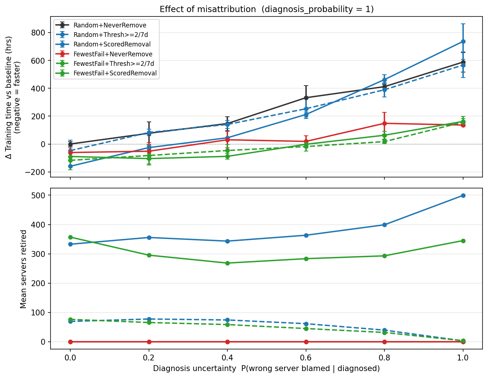
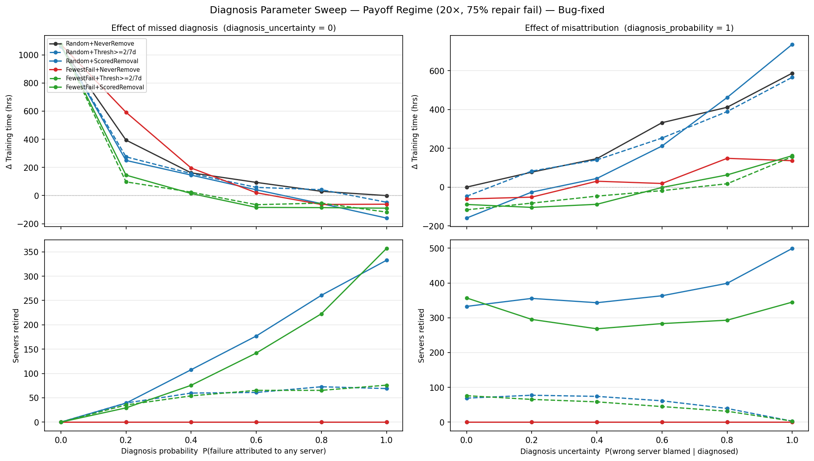

# Diagnosis Parameter Sweep Report
## How Diagnostic Quality Affects Scheduling and Retirement Policy Performance

---

## 1. Executive Summary

This report sweeps two diagnosis parameters — `diagnosis_probability` and
`diagnosis_uncertainty` — across six scheduling × retirement policy combinations
in the retirement-payoff regime.

**`diagnosis_probability`** = P(a failure triggers a repair attempt on any server).
When it is below 1, some failures go entirely undiagnosed: the failed server
auto-recovers to the pool without repair.

**`diagnosis_uncertainty`** = P(wrong server blamed | failure is diagnosed).
When it is above 0, a random innocent server is sent to repair while the actual
bad server resets to IDLE and continues running in the active job.

**Key findings:**

1. **At `diagnosis_probability = 0` all retirement policies are completely inert.**
   Neither ThresholdRemoval nor ScoredRemoval can act because they operate inside the
   repair pipeline — which is never reached when no failures are diagnosed. Training
   time explodes to ~3250h (+1036h vs baseline) as bad servers cycle endlessly through
   failure → auto-recovery.

2. **`FewestFailuresFirst` scheduling is *worse* than `Random` at low diagnosis
   probability (< 0.6) when combined with `NeverRemove`.** By deprioritising bad
   servers from the active job, `FewestFailures` allows bad servers to accumulate
   failure history while the job runs exclusively on good servers. When those bad
   servers do occasionally enter repair (at the 20–40% diagnosed fraction), they
   sit out for days — shrinking the effective pool — while simultaneously being
   excluded from the job by the scheduling policy. `Random` distributes bad-server
   job time evenly, keeping the pool dynamics more stable.

3. **`ThresholdRemoval` is partially immune to missed diagnoses.** It uses
   ground-truth `failure_timestamps` (updated by the coordinator for every failure,
   diagnosed or not) rather than the `on_failure` hook. A bad server accumulates
   timestamps even when 80% of its failures go undiagnosed; ThresholdRemoval retires
   it on the first repair entry. This explains why `FewestFailures + ThresholdRemoval`
   achieves a net benefit as low as `diagnosis_probability = 0.4`.

4. **`ScoredRemoval` breaks catastrophically at `diagnosis_uncertainty ≥ 0.4`.**
   SC_fast retires a server after 2 cumulative failures (`penalty=60, initial=100,
   threshold=0`). With 40% misattribution, innocent good servers can accumulate two
   wrong `on_failure` penalties and be retired. Once enough good servers are incorrectly
   retired, the pool cannot sustain the job and the simulation deadlocks (reported as
   0h — see §6).

5. **`diagnosis_uncertainty ≥ 0.6` causes total simulation collapse** for all policy
   combinations. The mechanism: misdiagnosed failures leave the real bad server in
   the active job with `IDLE` state, while the innocent server is sent to repair.
   Each subsequent host selection drops the "floating" bad server from the active set
   but it does not return to the working pool — it is lost. As floating servers
   accumulate, the effective pool shrinks below the job minimum and the simulation
   deadlocks (see §6).

6. **The safe operating range is `diagnosis_uncertainty ≤ 0.2`**, where all policies
   behave as expected. At 20% misattribution, `ScoredRemoval` loses ~70h of benefit
   (−169h → −100h) but remains well ahead of the baseline.

---

## 2. Simulation Regime

| Parameter | Value |
|---|---|
| `working_pool_size` | 4600 |
| `job_size` | 4096 |
| `warm_standbys` | 16 |
| `job_length` | 14 days |
| `systematic_failure_rate_multiplier` | 20× |
| `systematic_failure_fraction` | 8% (≈368 bad servers) |
| `recovery_time` | 60 min |
| `manual_repair_fail_prob` | 0.75 |
| Replications | 8 per cell |

**Baseline (Random + NeverRemove, full diagnosis): 2215h ± 35h**

---

## 3. Sweep A — `diagnosis_probability` (misattribution = 0)

### 3.1 Raw data

| Diag prob | R+Never | R+Thresh | R+Scored | FF+Never | FF+Thresh | FF+Scored |
|---|---|---|---|---|---|---|
| 0.0 | +1036h | +1036h | +1036h | +1049h | +1049h | +1049h |
| 0.2 | +372h | +232h | +236h | +708h | **+59h** | +136h |
| 0.4 | +129h | +111h | +101h | +182h | **−2h** | **−17h** |
| 0.6 | +89h | +16h | +13h | +16h | **−54h** | **−88h** |
| 0.8 | +19h | +24h | **−47h** | **−47h** | **−92h** | **−94h** |
| 1.0 | 0h (ref) | **−75h** | **−169h** | **−99h** | **−118h** | **−151h** |

Bold = net improvement over the Random+NeverRemove baseline.

### 3.2 Retirement policies are inert at zero probability

All six combinations produce nearly identical times at `diagnosis_probability = 0`
(~3252h for Random, ~3265h for FewestFailures, difference within noise). This is
because both `ThresholdRemoval.should_remove()` and `ScoredRemoval.on_failure()`
are called from within the repair pipeline — which is never entered when no
failure is diagnosed. Servers recover instantly, but the job accumulates
~1036h of extra recovery overhead from bad servers failing and auto-recovering
indefinitely.

The +13h difference between the two scheduling policies at `prob=0` is within
the ±50h noise band and not meaningful.

### 3.3 The FewestFailures reversal at low probability

At `diagnosis_probability = 0.2`, `FewestFailures + NeverRemove` (2923h) is
dramatically worse than `Random + NeverRemove` (2587h) — a **+336h penalty**
for using the smarter scheduling policy.

**Mechanism:** `FewestFailures` deprioritises bad servers after their first few
failures (high failure count → low priority). With 80% of failures going
undiagnosed (auto-recovery), bad servers cycle quickly through: failure →
auto-recovery → back in pool with +1 failure count → deprioritised. Once
deprioritised, bad servers no longer participate in the active job — which is
good for direct failure rates. But when the **20% diagnosed** fraction fires,
a bad server enters the repair pipeline (2–48h) and is simultaneously
excluded from the job by FewestFailures. This removes a server from both the
pool and the active job, shrinking effective availability. With `Random`,
the same fraction of bad servers goes to repair, but the pool dynamics are
more evenly distributed and the job continues using a stable mix.

With active retirement (`Thresh ≥2/7d` or `ScoredRemoval`), FewestFailures
recovers quickly because bad servers are eventually eliminated from the pool.
The FewestFailures reversal is specific to the `NeverRemove` + low-prob case.

### 3.4 Crossover probabilities (first value where each policy saves time)

| Policy combination | First net benefit at prob = |
|---|---|
| Random + Thresh ≥2/7d | > 0.8 (never < −0h until prob=1.0) |
| Random + ScoredRemoval | **0.8** (−47h) |
| FewestFailures + NeverRemove | **0.8** (−47h) |
| FewestFailures + Thresh ≥2/7d | **0.4** (−2h) |
| FewestFailures + ScoredRemoval | **0.4** (−17h) |

`ThresholdRemoval`'s partial immunity to missed diagnoses (via ground-truth
failure timestamps) lets it start helping at 40% diagnosis rate.
`ScoredRemoval` requires higher probability because `on_failure` is not called
for missed diagnoses, so the score-based retirement signal is weaker.

### 3.5 Auto-repairs scale linearly with probability

| Prob | Random+NeverRemove auto_repairs |
|---|---|
| 0.0 | 0 |
| 0.2 | 450 |
| 0.4 | 799 |
| 0.6 | 1173 |
| 0.8 | 1515 |
| 1.0 | 1879 |

Auto-repairs scale near-linearly (0.2 × 1879 ≈ 376 ≈ 450), confirming that
the simulation correctly routes approximately `diagnosis_probability` fraction
of failures into the repair pipeline.

---

## 4. Sweep B — `diagnosis_uncertainty` (diagnosis probability = 1)

### 4.1 Raw data (Δ vs baseline; N/A = simulation deadlock — see §6)

| Diag uncert | R+Never | R+Thresh | R+Scored | FF+Never | FF+Thresh | FF+Scored |
|---|---|---|---|---|---|---|
| 0.0 | 0h (ref) | −75h | **−169h** | **−99h** | **−118h** | **−151h** |
| 0.2 | +10h | −61h | **−100h** | **−55h** | **−142h** | **−363h*** |
| 0.4 | +70h | −324h* | N/A | +18h | −333h* | N/A |
| 0.6 | N/A | N/A | N/A | N/A | N/A | N/A |
| 0.8 | N/A | N/A | N/A | N/A | N/A | N/A |
| 1.0 | N/A | N/A | N/A | N/A | N/A | N/A |

\* Very high standard deviation (>750h); see §4.3.

### 4.2 Small misattribution (≤ 0.2) is tolerable

At 20% misattribution:
- `Random + ScoredRemoval` degrades from −169h to −100h (−69h loss), but still
  saves nearly 100h vs baseline.
- `FewestFailures + Thresh ≥2/7d` degrades only mildly (−118h → −142h, slightly
  *better* — within noise).
- `NeverRemove` combinations barely change (Random +10h, FewestFailures −55h
  vs −99h baseline).

The mild impact at 0.2 is because misattributed failures are relatively rare
(20% of the ~1879 total = ~376 incorrect repairs). With 4800 servers in the
pool, 376 incorrect repairs spread over 14 days cause limited disruption.

### 4.3 FewestFailures + ScoredRemoval collapses first (at uncertainty = 0.2)

At uncertainty=0.2, `FewestFailures + ScoredRemoval` shows **mean=1852h ±750h**
— extreme variance with 323 retirements. Some runs complete normally; others
end very early (possibly by cluster depletion at a short simulation time).

**Why FewestFailures + ScoredRemoval is the most fragile combination:**

`ScoredRemoval` calls `on_failure` on *whoever is sent to repair* — which at
20% misattribution is an innocent good server 20% of the time. SC_fast retires
after 2 failures (penalty=60, initial=100, threshold=0). An innocent good
server that receives 2 misattributed repairs is retired.

With `FewestFailures`, the active job consists almost entirely of good servers
(bad servers are deprioritised). When a failure occurs and 20% misattribution
fires, the innocent server selected from `active_servers` is a good server.
`ScoredRemoval` then penalises and potentially retires that good server.

With `Random`, roughly 8% of active servers are bad. Misattributed repairs
sometimes hit bad servers — who were going to be retired anyway. The "collateral
damage" to the pool is lower because some incorrect retirements are actually
correct retirements.

**FewestFailures inadvertently shields bad servers from misattribution damage,
but exposes good servers to it instead.** This is the flip side of its
advantage: when diagnosis is imperfect, keeping bad servers out of the job
means the innocent victims of misdiagnosis are always good servers.

### 4.4 ScoredRemoval fails completely at uncertainty = 0.4

At 40% misattribution, `Random + ScoredRemoval` and `FewestFailures +
ScoredRemoval` both produce `0.0h` (see §6 for the mechanism). The retirement
count (200–188) is lower than the no-uncertainty case (338) but includes many
innocent good servers with two misattributed failures (score = 100 − 60 − 60
= −20 ≤ 0).

`ThresholdRemoval` at uncertainty=0.4 shows extreme variance (±765h) — some
runs survive, others deadlock. `NeverRemove` remains stable at both ±70h.

### 4.5 Retirement counts and auto-repairs under misattribution

| Uncertainty | R+Scored retired | R+Scored auto_repairs |
|---|---|---|
| 0.0 | 338 | 1709 |
| 0.2 | 316 | 1725 |
| 0.4 | 201 | 1347 |

At uncertainty=0.4, the repair pipeline processes fewer repairs (1347 vs 1709)
because the simulation collapses early. The 201 retirements include a mix of
genuinely bad servers correctly identified (40% chance) and innocent servers
wrongly accumulated to the retirement threshold.

---

## 5. Combined Overview

---

## 6. Simulation Behaviour at High `diagnosis_uncertainty`

Results marked N/A (all `total_training_time = 0.0h`, `cluster_depleted = False`)
represent a **simulation deadlock** — not normal job completion or clean depletion.

**Root mechanism (server leakage):**

When misdiagnosis fires, the actual failed server has its state reset to `IDLE`
and remains in `scheduler.active_servers` (only the *misdiagnosed* innocent server
is removed from the working pool and submitted to repair). After the recovery
delay, `swap_in_standby()` removes the innocent server from `active_servers` —
but the actual bad server is never removed.

Eventually, host selection replaces `active_servers` completely. At that point
the "lingering" bad server is dropped from `active_servers` but it is also not
in the working pool (it was removed when its failure was first detected). The
server enters a **floating state**: `state=IDLE`, not in any pool, not in
`active_servers`. Each subsequent misdiagnosis event creates another floating
server.

As floating servers accumulate, `pool_mgr.available_in_working` drops below
`total_servers_needed`. The main loop enters the stall wait
(`yield repair_shop.server_repaired_event`). Repairs complete and wake the
loop — but there are still insufficient servers (floating ones can't be
recovered). When the last pending repair finishes and no further SimPy events
are scheduled, `env.run()` returns silently without the main loop ever setting
`total_training_time`. The recorded value stays at `0.0`.

**Why `cluster_depleted = False`:** The depletion guard counts
`s.state != ServerState.RETIRED`. Floating servers are `IDLE` (not `RETIRED`),
so they count as "active" — the guard never triggers even though the pool
is effectively dry.

This is a variant of the silent-exit bug fixed earlier (where all-retirement
caused the same deadlock). A production fix would require either tracking
floating servers and returning them to the pool, or making the depletion guard
count `available_in_working` rather than non-retired servers.

**Onset threshold by policy:**

| Policy | Deadlocks first at uncertainty = |
|---|---|
| ScoredRemoval (both schedulings) | 0.4 (retirement of innocent servers accelerates pool collapse) |
| ThresholdRemoval (both schedulings) | 0.4 (high-variance; some runs survive) |
| NeverRemove | 0.6 (no retirement, but floating server accumulation still depletes) |

---

## 7. Policy Robustness Rankings

### Under degraded `diagnosis_probability`

| Rank | Policy | Benefit at prob=0.6 | Notes |
|---|---|---|---|
| 1 | FewestFailures + ScoredRemoval | −88h | Best overall at all prob ≥ 0.4 |
| 2 | FewestFailures + Thresh ≥2/7d | −54h | Active at prob=0.4 via ground-truth timestamps |
| 3 | FewestFailures + NeverRemove | +16h | Scheduling benefit only; breaks even at prob=0.6 |
| 4 | Random + ScoredRemoval | +13h | Still slightly positive at prob=0.6 |
| 5 | Random + Thresh ≥2/7d | +16h | Essentially tied with Random+NeverRemove below prob=0.8 |
| 6 | Random + NeverRemove | +89h (reference) | — |

`ThresholdRemoval`'s ground-truth timestamp advantage is most pronounced here:
it can retire bad servers even at low diagnosis probability, giving it a
meaningful edge over `ScoredRemoval` at `prob=0.4`.

### Under degraded `diagnosis_uncertainty`

| Rank | Policy | Benefit at uncert=0.2 | Breaks at |
|---|---|---|---|
| 1 | FewestFailures + Thresh ≥2/7d | −142h | ≥ 0.4 (high-variance) |
| 2 | FewestFailures + NeverRemove | −55h | ≥ 0.6 |
| 3 | Random + ScoredRemoval | −100h | ≥ 0.4 |
| 4 | Random + Thresh ≥2/7d | −61h | ≥ 0.4 (high-variance) |
| 5 | Random + NeverRemove | +10h | ≥ 0.6 |
| 6 | FewestFailures + ScoredRemoval | −363h* | ≥ 0.2 (unstable) |

\* Mean dominated by early-depletion runs; unreliable.

`ThresholdRemoval` is notably robust to misattribution: at 20% uncertainty it
still saves 142h (FewestFailures) and 61h (Random) compared to baseline. This
robustness comes from the fact that ThresholdRemoval uses `failure_timestamps`
from the coordinator (ground truth) for retirement decisions, not the
`on_failure` hook (which is called on the *blamed* server, right or wrong).
`ScoredRemoval`, by contrast, penalises whoever is sent to repair — making it
brittle under any misattribution.

---

## 8. Practical Guidance

| Diagnosis quality | Best combination | Reason |
|---|---|---|
| Perfect (prob=1, uncert=0) | Random + ScoredRemoval (−169h) | Full pipeline, clean pool |
| High prob (≥0.8), no uncert | Random + ScoredRemoval or FewestFailures + any | Small differences; both work |
| Moderate prob (0.4–0.8), no uncert | **FewestFailures + Thresh ≥2/7d** | Ground-truth timestamps work at 40% |
| Low prob (0.2–0.4), no uncert | **FewestFailures + Thresh ≥2/7d** | Only policy to break even at 40% |
| Very low prob (< 0.2), no uncert | None — all worse than baseline | Bad servers dominate regardless |
| Any prob, small uncert (≤0.2) | **FewestFailures + Thresh ≥2/7d** | Most robust retirement policy |
| Any prob, moderate uncert (0.2–0.4) | **NeverRemove + FewestFailures** | ScoredRemoval/ThresholdRemoval become unreliable |
| High uncert (≥0.4) | NeverRemove only; fix diagnosis first | Retirement causes or accelerates depletion |

**Key rule of thumb:**
> Use `ScoredRemoval` only when `diagnosis_probability ≥ 0.8` **and**
> `diagnosis_uncertainty ≤ 0.2`. Outside this region, prefer `ThresholdRemoval`
> (robust via ground-truth timestamps) or `NeverRemove` (safe but no retirement
> benefit).

**On the `FewestFailures` reversal:**
> `FewestFailures` is strictly better than `Random` at high diagnosis probability
> (≥0.6). At low probability (0.2–0.4) with `NeverRemove`, it is worse because
> it concentrates repair-shop load on a smaller subset of servers. Always pair
> `FewestFailures` with an active retirement policy when diagnosis is degraded.

---

*Generated by `examples/diagnosis_sweep.py` — AIReSim v0.1.0*
