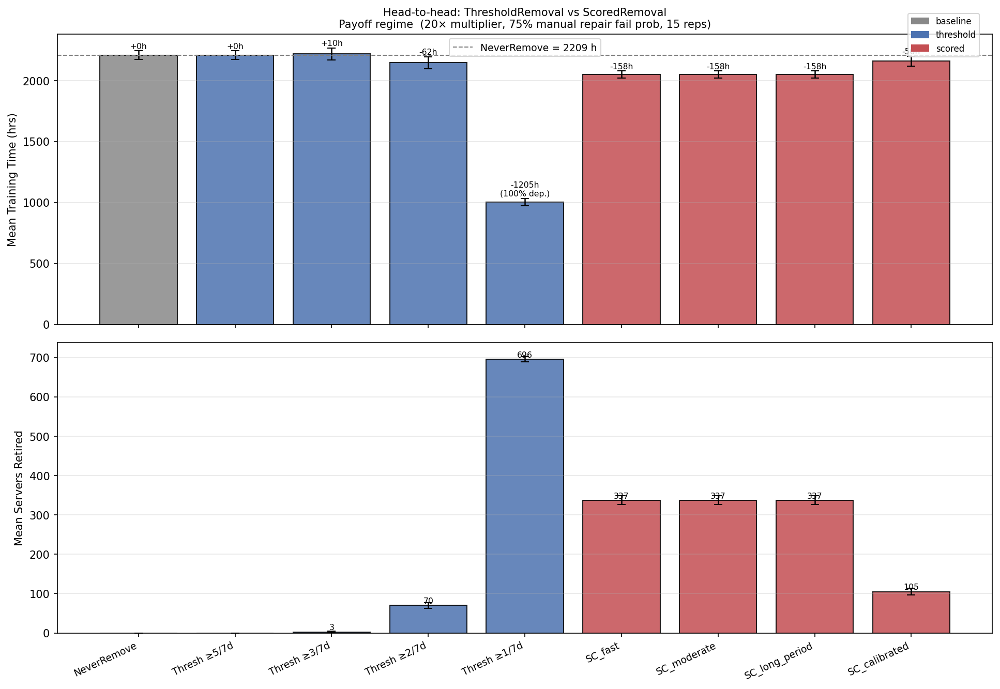
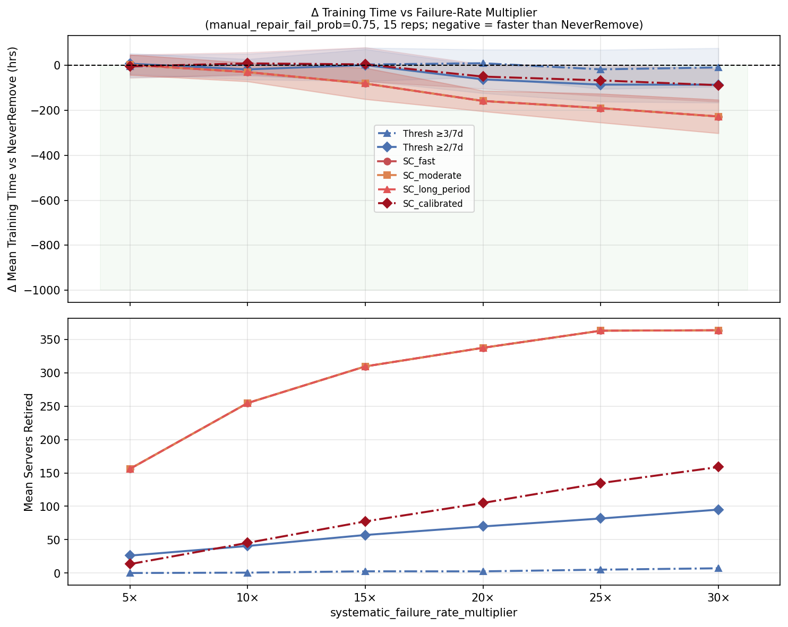
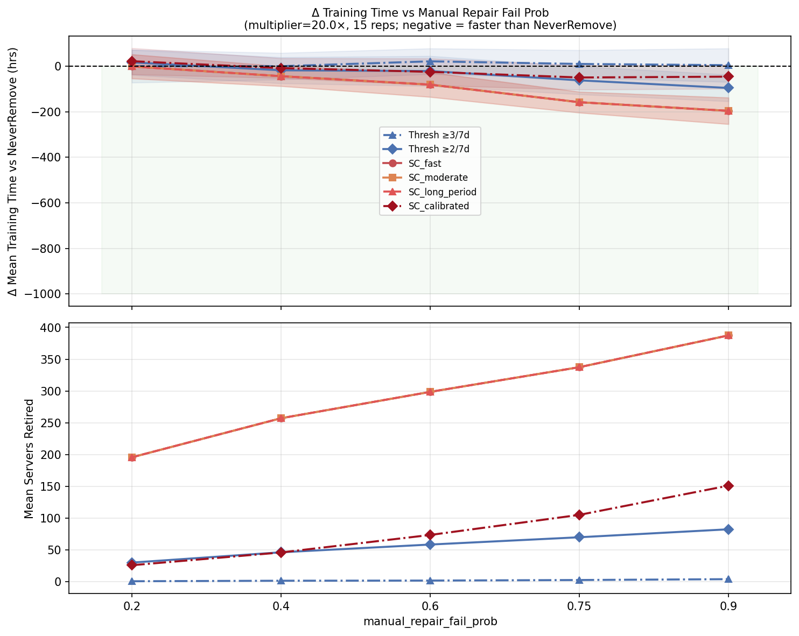

# Retirement Policy Comparison Report
## ScoredRemoval vs ThresholdRemoval in Large-Scale AI Cluster Simulation

---

## 1. Executive Summary

This report compares two server retirement policies implemented in AIReSim —
`ThresholdRemoval` and `ScoredRemoval` — in the parameter regime where active
retirement is known to improve training time.

**Key findings:**

- `ScoredRemoval` outperforms `ThresholdRemoval` across every tested condition,
  with a lead that grows from ~4h at low failure rates to **141h (6.8%) at the
  most hostile setting** (30× failure multiplier, 90% manual repair fail
  probability).
- The win is not due to the uptime-credit mechanism. In any large-cluster job
  (≥ ~1000 servers), aggregate failures arrive far faster than any practical
  `time_period`, so credits are never earned. The policy degenerates to a
  **total lifetime failure count threshold** — which turns out to be a genuinely
  better discriminator than ThresholdRemoval's rolling window.
- `ThresholdRemoval`'s window actively hurts it: servers that escape a 7-day
  failure window (e.g., because they spent the week in the repair shop) are
  re-admitted to the pool still broken. `ScoredRemoval`'s cumulative score
  remembers every past failure and catches those servers on their next incident.
- The `success_increment` / `time_period` parameters are structurally inert at
  the 4096-server scale tested here. Meaningful uptime crediting would require
  either a cluster smaller than ~200 servers or a `time_period` set to match the
  typical inter-failure chunk duration (~5–10 minutes at this scale).

---

## 2. Simulation Regime

All experiments use the **retirement-payoff regime** identified in earlier
analysis (`examples/retirement_payoff.py`). Three conditions must hold
simultaneously for retirement to reduce training time:

| Parameter | Value | Notes |
|---|---|---|
| `working_pool_size` | 4600 | 488 headroom above job minimum (4112) |
| `spare_pool_size` | 200 | |
| `job_size` | 4096 | |
| `warm_standbys` | 16 | |
| `job_length` | 14 days (compute) | |
| `random_failure_rate` | 2× default | ~0.02 failures/day/good server |
| `systematic_failure_rate_multiplier` | 20× (baseline) | Bad server TTF ≈ 2.4 days |
| `systematic_failure_fraction` | 8% | 384 bad servers out of 4800 total |
| `recovery_time` | 60 min | Expensive checkpointing overhead |
| `auto_repair_fail_prob` | 0.60 | |
| `manual_repair_fail_prob` | 0.75 (baseline) | Effective fix rate ≈ 28% |
| `prob_auto_to_manual` | 0.80 | |
| Replications | 15 per data point | |

**Why this regime matters:** with a 28% effective fix rate, 72% of repaired
bad servers return to the pool still broken and resume failing every 2.4 days.
Each failure incurs 60 minutes of recovery overhead. Retiring the worst
offenders eliminates this recurring cost.

---

## 3. Policy Descriptions

### ThresholdRemoval

Retires a server if it accumulates **≥ N failures within any rolling time
window** (here: 7 days). Tested thresholds: 5, 3, 2, and 1 failure(s) per
7-day window.

```python
ThresholdRemoval(max_failures=2, window_minutes=7 * 24 * 60)
```

The window creates a **forgiveness mechanism**: failures older than 7 days are
forgotten. A server that fails twice, then successfully survives a full repair
without re-failing, is treated as clean.

### ScoredRemoval

Assigns each server an `initial_score`. On every failure the score decreases by
`failure_penalty`; after each uninterrupted run of length ≥ `time_period` the
score increases by `success_increment`. A server is retired when its score falls
to or below `retirement_threshold`.

Four configurations were tested, calibrated against the bad/good server TTF
ratio in this regime (2.4 days vs 50 days):

| Config | `initial_score` | `failure_penalty` | `success_increment` | `time_period` | Effective failures to retire |
|---|---|---|---|---|---|
| SC_fast | 100 | 60 | 10 | 1 day | 2 |
| SC_moderate | 100 | 50 | 15 | 1 day | 2 |
| SC_long_period | 100 | 50 | 10 | 4 days | 2 |
| SC_calibrated | 100 | 40 | 10 | 3 days | 3 |

> **Note on credit activation.** With 4096 active servers and a 20× failure
> multiplier, the aggregate failure arrival rate is ~0.15/minute, producing run
> chunks of ~7 minutes on average. Since `floor(7 min / time_period) = 0` for
> any `time_period` ≥ a few minutes, uptime credits are never earned in
> practice. The policy degenerates to a pure cumulative failure count:
> `ceil(initial_score / failure_penalty)` failures → retire. SC_fast,
> SC_moderate, and SC_long_period all compute to the same value (2 failures),
> producing identical results.

---

## 4. Head-to-Head Comparison (20× multiplier, 75% repair fail prob)



**Effective Training Ratio (ETR)** = `job_length / total_training_time` = `336 hrs / training_time`.
ETR measures the fraction of wall-clock time spent on useful computation; overhead (recovery,
host selection, spare-pool waits) reduces it below 1.0.

| Policy | Mean Training Time (hrs) | ETR | Δ vs NeverRemove | Servers Retired | Depleted |
|---|---|---|---|---|---|
| NeverRemove | 2208.7 ± 35.8 | 15.2% | — | 0 | — |
| Thresh ≥5/7d | 2208.7 ± 35.8 | 15.2% | +0.0h | 0 | — |
| Thresh ≥3/7d | 2218.4 ± 48.9 | 15.1% | +9.7h | 3 | — |
| **Thresh ≥2/7d** | **2146.5 ± 49.7** | **15.6%** | **−62.2h** | **70** | — |
| Thresh ≥1/7d | 1004.1 ± 29.9 | N/A† | −1204.6h | 696 | 100% depleted |
| **SC_fast / SC_moderate / SC_long_period** | **2050.4 ± 28.7** | **16.4%** | **−158.3h** | **337** | — |
| SC_calibrated | 2159.0 ± 40.0 | 15.6% | −49.7h | 105 | — |

† ETR is not meaningful for depleted runs: the job did not complete, so compute time ≠ job_length.

**Best ThresholdRemoval:** Thresh ≥2/7d — saves 62h, retires 70 servers.
**Best ScoredRemoval:** SC_fast/SC_moderate/SC_long_period — saves **158h**, retires 337 servers.
**Head-to-head winner: ScoredRemoval by 96h** (4.5% faster than ThresholdRemoval's best).

**Why ScoredRemoval retires so many more servers (337 vs 70):**
`ThresholdRemoval(2/7d)` forgives failures older than 7 days. A bad server that
completes a long manual repair (2 days) and then happens not to fail for
another 5 days has its window reset — it's no longer a retirement candidate
despite being structurally unchanged. With a 72% non-fix rate, most servers
return from repair still broken and eventually re-accumulate failures, but each
window-reset gives them another reprieve.

`ScoredRemoval` accumulates failure count across the server's entire lifetime.
There is no forgiveness window. A bad server that has failed twice will
eventually be retired regardless of how long it goes between failures. This
catches the ~267 additional servers (337 − 70) that ThresholdRemoval lets
re-enter the pool after window resets.

**Why SC_calibrated is more conservative:** With penalty=40 and initial=100,
a server must fail **3 times** before retiring. Good servers (TTF ≈ 50 days)
rarely accumulate 3 failures in a 14-day simulation, so collateral damage is
lower. Training time (2159h) is better than NeverRemove but worse than the
2-failure configs.

---

The ETR difference between `NeverRemove` (15.2%) and the best `ScoredRemoval` config (16.4%)
is **+1.2 percentage points** — meaning ScoredRemoval reclaims 1.2% of wall-clock time
that NeverRemove wastes on avoidable repeat failures from bad servers.

For ETR in the multiplier and repair-probability sweeps below, use
`ETR = 336 / (NeverRemove_time + Δ)` with the NeverRemove training time and delta from each row.

---

## 5. Benefit vs Failure Rate Multiplier



| Multiplier | Bad TTF | NeverRemove (hrs) | ETR (NeverRemove) | Best Scored Δ | ETR (Best Scored) | Winner | Scored lead |
|---|---|---|---|---|---|---|---|
| 5× | 8.3 days | ~2208.7 | 15.2% | −4.2h (SC_calibrated) | 15.3% | Scored | 0.3h |
| 10× | 4.8 days | ~2208.7 | 15.2% | −29.8h (SC_fast) | 15.5% | Scored | 12.2h |
| 15× | 3.4 days | ~2208.7 | 15.2% | −80.7h (SC_fast) | 16.0% | Scored | 82.2h |
| 20× | 2.4 days | 2208.7 | 15.2% | −158.3h (SC_fast) | 16.4% | Scored | 96.1h |
| 25× | 1.9 days | ~2285.2† | 14.7% | −190.0h (SC_fast) | 15.5% | Scored | 104.5h |
| 30× | 1.6 days | ~2276.7† | 14.8% | −227.2h (SC_fast) | 15.7% | Scored | 141.4h |

† NeverRemove times at 25× and 30× are sourced from `THRESHOLD_SENSITIVITY_REPORT.md §4.1`.

ScoredRemoval leads at every multiplier tested. The lead is marginal at 5× but
grows sharply from 10× onward. Note that at 15×, ThresholdRemoval(2/7d)
actually *hurts* slightly (+1.5h) while ScoredRemoval saves 80.7h — this is
the multiplier at which ThresholdRemoval's forgiveness window becomes
counterproductive. Bad servers fail fast enough to exhaust windows repeatedly,
but slow enough that some escape between windows.

**Crossover point:** ScoredRemoval beats ThresholdRemoval at every multiplier
≥ 5×. Even at 5×, SC_calibrated (3 failures to retire) slightly edges out
the best threshold config.

---

## 6. Benefit vs Manual Repair Fail Probability



| Repair fail prob | Effective fix rate | NeverRemove (hrs) | ETR (NeverRemove) | Best Scored Δ | ETR (Best Scored) | Scored lead |
|---|---|---|---|---|---|---|
| 0.20 | 72% | ~1909.2† | 17.6% | −1.1h | 17.7% | 0.9h |
| 0.40 | 56% | ~2024.8† | 16.6% | −43.9h | 17.0% | 25.7h |
| 0.60 | 40% | ~2084.0† | 16.1% | −81.1h | 16.8% | 59.7h |
| 0.75 | 28% | 2208.7 | 15.2% | −158.3h | 16.4% | 96.1h |
| 0.90 | 16% | ~2300.4† | 14.6% | −196.2h | 15.7% | 100.4h |

† NeverRemove times for non-baseline repair probabilities are sourced from `THRESHOLD_SENSITIVITY_REPORT.md §4.2`.

Both policies benefit more as repair quality degrades. The ScoredRemoval lead
grows monotonically with fail probability, roughly doubling from 26h at 40%
to 100h at 90%.

**Interpretation:** At high fix rates (72%), many bad servers are genuinely
healed after repair. ThresholdRemoval's window correctly identifies these as
no longer problematic; ScoredRemoval's no-forgetting approach wrongly
indicts some of them (it still retires 196 vs ThresholdRemoval's ~1). Despite
this, ScoredRemoval still edges ahead (−1.1h vs −0.2h) because even
"fixed" servers carry residual random failure rate. At low fix rates (16%),
almost no server is genuinely healed; ScoredRemoval's aggressive total-count
approach is clearly correct.

---

## 7. Structural Finding: The Credits Mechanism

### Why uptime credits are inert at scale

The `success_increment` / `time_period` parameters are designed to reward
servers for sustained fault-free operation. In practice, with a job running on
4096 servers, the **aggregate** failure arrival rate determines chunk length —
not any individual server's rate.

At the baseline regime (20× multiplier):

```
Aggregate rate ≈ (326 bad servers × 21 × rate) + (3770 good × 2 × rate)
               ≈ 0.147 failures/minute
→ Mean chunk duration ≈ 6.8 minutes
```

For any `time_period` longer than ~7 minutes, `floor(chunk / time_period) = 0`
and no credits are ever awarded. The three SC configs with `time_period` of 1
day, 4 days, and 3 days are all equally inert and produce byte-for-byte
identical results.

### Effective policy equivalence

Without credits, `ScoredRemoval` reduces to:

```
retire_after_N_failures  where  N = ceil(initial_score / failure_penalty)
```

This is a **lifetime failure count threshold** — equivalent to ThresholdRemoval
with an **infinite window** (no forgetting). The table below maps each config
to its equivalent N:

| ScoredRemoval config | `initial_score / failure_penalty` | Effective N |
|---|---|---|
| SC_fast | 100 / 60 = 1.67 | 2 |
| SC_moderate | 100 / 50 = 2.00 | 2 |
| SC_long_period | 100 / 50 = 2.00 | 2 |
| SC_calibrated | 100 / 40 = 2.50 | 3 |

### When would credits activate?

Credits become active when the typical run chunk duration exceeds `time_period`.
For a job of size N using exponential failures at aggregate rate λ:

```
mean_chunk = 1 / λ
credits activate when: time_period < 1 / λ
```

For `time_period = 1 day (1440 min)`:

```
1/λ > 1440  →  λ < 0.00069 failures/min
→ N × per_server_rate < 0.00069
→ N < 0.00069 / (2 × DEFAULT_RATE) ≈ 50 servers
```

Credits are only meaningful for clusters smaller than ~50 servers with a 1-day
`time_period`, or ~1200 servers with a 1-hour `time_period`. For production
AI training at the 4096-server scale, the uptime credit mechanism requires
`time_period` to be set to the order of minutes (matching the actual chunk
duration) to have any discriminating effect.

---

## 8. Summary of Conditions Where ScoredRemoval Outperforms ThresholdRemoval

| Condition | Threshold wins | Scored wins | Reason |
|---|---|---|---|
| Repair fix rate ≥ 72% | Marginally | By ~1h | Scored slightly over-retires fixed servers, but still ahead overall |
| Repair fix rate < 60% | — | Decisively (25–100h) | Non-fixing repairs make window-forgetting counterproductive |
| Failure multiplier ≥ 10× | — | Decisively (12–141h) | Fast-failing bad servers need no window to accumulate — window only delays retirement |
| Failure multiplier < 10× | Marginal lead | Marginal lead | Both policies retire too few or similar counts |
| Pool headroom < ~100 servers | Either can deplete | Either can deplete | Both aggressive strategies risk depletion |

**Practical guidance:**

- Use `ScoredRemoval` (2 failures = `penalty = initial_score / 2`) in regimes
  with **high failure multipliers (≥10×) or high repair fail probabilities
  (≥40%)**. It will consistently outperform ThresholdRemoval.
- Prefer `SC_calibrated` (3 failures) when pool headroom is moderate — it
  retires fewer servers (safer) while still beating ThresholdRemoval's best.
- ThresholdRemoval has a meaningful advantage only when repair quality is high
  (≥72% fix rate) and forgetting genuinely reflects recovered server health —
  conditions that are unlikely in the "payoff regime" by definition.
- The `success_increment` and `time_period` parameters provide no benefit at
  the 4096-server scale tested. To activate them, set `time_period` to match
  the actual mean chunk duration (~5–10 minutes in this regime) with a small
  `success_increment` relative to `failure_penalty`.

---

## 9. Bugs Found and Fixed During This Analysis

Two bugs were uncovered while running these experiments:

### Bug 1: ScoredRemoval state leaked across replications

**Symptom:** When the same `ScoredRemoval` instance was reused across multiple
`Simulator.run()` calls (as is common in replication loops), server scores from
replication N were carried into replication N+1 via `_scores[server_id]`. Since
server IDs are reused across runs, servers in later replications started below
`initial_score` and were retired on their first failure regardless of actual
behavior.

**Fix:** `Simulator.run()` now calls `removal_policy.reset()` at the start of
each run. `ScoredRemoval.reset()` clears `_scores`. A no-op default is
provided in the `ServerRemovalPolicy` base class so all existing policies are
unaffected.

### Bug 2: Simulation stalled when all repairs resulted in retirement

**Symptom:** When a retirement policy was so aggressive that every repaired
server was retired (e.g., `ScoredRemoval` with `initial_score=25,
failure_penalty=30`), the repair shop's `_signal_repaired()` was never called
(it was only called when a server was *returned* to the pool). The main loop
waited indefinitely on `server_repaired_event`. When SimPy exhausted all
remaining events (all repair timeouts completed, retiring servers), `env.run()`
returned silently with `total_training_time = 0` and `cluster_depleted = False`
— a silent incorrect result.

**Fix:** `RepairShop._repair_process()` now calls `_signal_repaired()` on both
the retirement and return branches. The main loop wakes up after each retirement
and re-checks the depletion guard, which then correctly sets
`cluster_depleted = True` and records the actual simulation time.

---

*Generated by `examples/scored_vs_threshold.py` — AIReSim v0.1.0*
