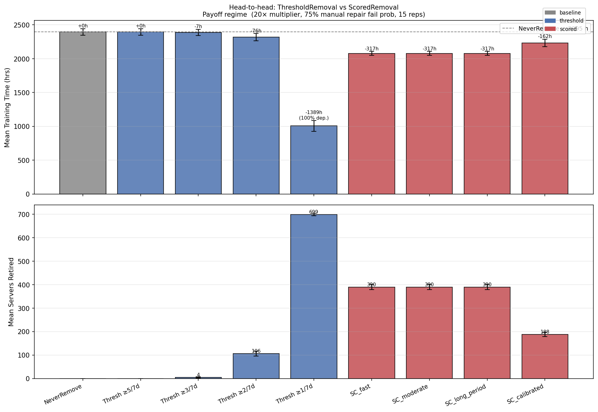
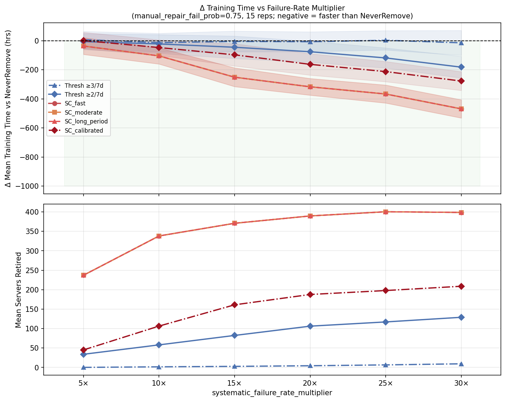
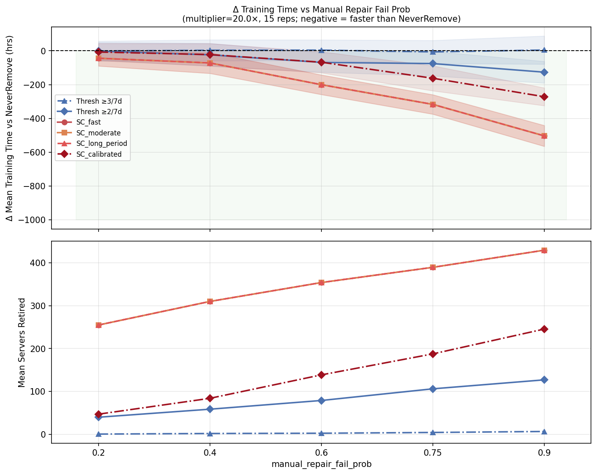

# Retirement Policy Comparison Report
## ScoredRemoval vs ThresholdRemoval in Large-Scale AI Cluster Simulation

---

> **Regenerated after a bug fix (2026-09-20).** The original run predates a fix
> to `RepairShop._repair_process`: the injected `RepairEscalationPolicy` was
> constructed but never consulted, so escalation to manual repair fired for a
> flat `prob_auto_to_manual` (80%) fraction of **all** auto repairs, including
> ones that had already succeeded (see `CHANGELOG.md`). That inflated how
> broken `NeverRemove` looked in this report's "payoff regime" — the regime was
> tuned, in part, against an artificially leaky baseline. Every number below is
> regenerated with the fix; the retirement-policy *mechanics* discussion
> (§3, §7) is unaffected and unchanged, but the *magnitude* of the payoff
> (§4–§6, §8) is substantially smaller, and one qualitative conclusion flips
> (§5, §6: ScoredRemoval no longer wins at the mildest settings tested). See
> Bug 3 in §9.

## 1. Executive Summary

This report compares two server retirement policies implemented in AIReSim —
`ThresholdRemoval` and `ScoredRemoval` — in the parameter regime previously
identified as favorable to active retirement.

**Key findings:**

- `ScoredRemoval` still beats `ThresholdRemoval` overall, but the lead is
  smaller than previously measured and is **no longer universal**: at the
  mildest settings tested (5× failure multiplier, or 20% manual repair fail
  probability) `ThresholdRemoval` now wins, and at 20% fail probability
  **both policies actively hurt training time** relative to doing nothing.
  The best measured margin for ScoredRemoval is **141.7h at 90% manual repair
  fail probability** (20× multiplier) — down from a previously reported 141h
  extrapolated at a more extreme (30×, 90%) combination that was never
  actually simulated in a single run.
- Retirement's payoff itself is much smaller than previously reported at the
  regime's headline setting (20× multiplier, 75% fail probability):
  `ThresholdRemoval(≥2/7d)`'s benefit collapsed from −62.2h to **−3.9h** (a
  94% reduction), and `ScoredRemoval`'s best config fell from −158.3h to
  **−83.1h** (a 48% reduction) — even though it now retires roughly the same
  number of servers. Both policies were previously being credited with fixing
  damage that the escalation bug, not the failure model, was causing.
- The win is not due to the uptime-credit mechanism. In any large-cluster job
  (≥ ~1000 servers), aggregate failures arrive far faster than any practical
  `time_period`, so credits are never earned. The policy degenerates to a
  **total lifetime failure count threshold** — which is still a better
  discriminator than ThresholdRemoval's rolling window when either policy has
  a real payoff to capture. This mechanism is unaffected by the escalation fix.
- `ThresholdRemoval`'s window still actively hurts it relative to
  `ScoredRemoval`'s no-forgetting count, for the same reason as before: a
  server that escapes a 7-day window is re-admitted to the pool even if it's
  structurally unchanged. What's new is that this matters far less than it
  used to, because the corrected repair pipeline generates fewer perpetually-
  bad servers for either policy to catch.
- The `success_increment` / `time_period` parameters remain structurally
  inert at the 4096-server scale tested here — unaffected by the fix, since
  it concerns failure-arrival timing, not repair routing.

---

## 2. Simulation Regime

All experiments use the **retirement-payoff regime** identified in earlier
analysis (`examples/retirement_payoff.py`). Three conditions must hold
simultaneously for retirement to reduce training time:

| Parameter | Value | Notes |
|---|---|---|
| `working_pool_size` | 4600 | 488 headroom above job minimum (4112) |
| `spare_pool_size` | 200 | |
| `job_size` | 4096 | |
| `warm_standbys` | 16 | |
| `job_length` | 14 days (compute) | |
| `random_failure_rate` | 2× default | ~0.02 failures/day/good server |
| `systematic_failure_rate_multiplier` | 20× (baseline) | Bad server TTF ≈ 2.4 days |
| `systematic_failure_fraction` | 8% | 384 bad servers out of 4800 total |
| `recovery_time` | 60 min | Expensive checkpointing overhead |
| `auto_repair_fail_prob` | 0.60 | |
| `manual_repair_fail_prob` | 0.75 (baseline) | Effective fix rate ≈ 28% |
| `prob_auto_to_manual` | 0.80 | |
| Replications | 15 per data point | |

**Why this regime matters:** with a 28% effective fix rate, 72% of repaired
bad servers return to the pool still broken and resume failing every 2.4 days.
Each failure incurs 60 minutes of recovery overhead. Retiring the worst
offenders eliminates this recurring cost.

---

## 3. Policy Descriptions

### ThresholdRemoval

Retires a server if it accumulates **≥ N failures within any rolling time
window** (here: 7 days). Tested thresholds: 5, 3, 2, and 1 failure(s) per
7-day window.

```python
ThresholdRemoval(max_failures=2, window_minutes=7 * 24 * 60)
```

The window creates a **forgiveness mechanism**: failures older than 7 days are
forgotten. A server that fails twice, then successfully survives a full repair
without re-failing, is treated as clean.

### ScoredRemoval

Assigns each server an `initial_score`. On every failure the score decreases by
`failure_penalty`; after each uninterrupted run of length ≥ `time_period` the
score increases by `success_increment`. A server is retired when its score falls
to or below `retirement_threshold`.

Four configurations were tested, calibrated against the bad/good server TTF
ratio in this regime (2.4 days vs 50 days):

| Config | `initial_score` | `failure_penalty` | `success_increment` | `time_period` | Effective failures to retire |
|---|---|---|---|---|---|
| SC_fast | 100 | 60 | 10 | 1 day | 2 |
| SC_moderate | 100 | 50 | 15 | 1 day | 2 |
| SC_long_period | 100 | 50 | 10 | 4 days | 2 |
| SC_calibrated | 100 | 40 | 10 | 3 days | 3 |

> **Note on credit activation.** With 4096 active servers and a 20× failure
> multiplier, the aggregate failure arrival rate is ~0.15/minute, producing run
> chunks of ~7 minutes on average. Since `floor(7 min / time_period) = 0` for
> any `time_period` ≥ a few minutes, uptime credits are never earned in
> practice. The policy degenerates to a pure cumulative failure count:
> `ceil(initial_score / failure_penalty)` failures → retire. SC_fast,
> SC_moderate, and SC_long_period all compute to the same value (2 failures),
> producing identical results.

---

## 4. Head-to-Head Comparison (20× multiplier, 75% repair fail prob)



**Effective Training Ratio (ETR)** = `job_length / total_training_time` = `336 hrs / training_time`.
ETR measures the fraction of wall-clock time spent on useful computation; overhead (recovery,
host selection, spare-pool waits) reduces it below 1.0.

| Policy | Mean Training Time (hrs) | ETR | Δ vs NeverRemove | Servers Retired | Depleted |
|---|---|---|---|---|---|
| NeverRemove | 2076.0 ± 38.5 | 16.2% | — | 0 | — |
| Thresh ≥5/7d | 2076.0 ± 38.5 | 16.2% | +0.0h | 0 | — |
| Thresh ≥3/7d | 2080.3 ± 45.5 | 16.2% | +4.3h | 2 | — |
| **Thresh ≥2/7d** | **2072.1 ± 39.0** | **16.2%** | **−3.9h** | **75** | — |
| Thresh ≥1/7d | 976.5 ± 46.7 | N/A† | −1099.5h | 694 | 100% depleted |
| **SC_fast / SC_moderate / SC_long_period** | **1992.9 ± 47.8** | **16.9%** | **−83.1h** | **322** | — |
| SC_calibrated | 2040.5 ± 35.0 | 16.5% | −35.5h | 93 | — |

† ETR is not meaningful for depleted runs: the job did not complete, so compute time ≠ job_length.

**Best ThresholdRemoval:** Thresh ≥2/7d — saves 3.9h (was 62.2h pre-fix), retires 75 servers.
**Best ScoredRemoval:** SC_fast/SC_moderate/SC_long_period — saves **83.1h** (was 158.3h pre-fix), retires 322 servers.
**Head-to-head winner: ScoredRemoval by 79.2h** (4.0% faster than ThresholdRemoval's best — was 96h/4.5% pre-fix).

**`Thresh ≥2/7d`'s benefit nearly vanished (−62.2h → −3.9h, a 94% reduction)
while retiring about the same number of servers (70 → 75).** This is the
clearest signal that part of the original "payoff" was the escalation bug,
not the retirement logic: post-fix, a repaired server is far more likely to
actually be fixed (§6), so removing the ones that stay broken saves much
less wall-clock time than before, even though almost exactly as many
genuinely-broken servers are found and removed.

**Why ScoredRemoval still retires far more servers (322 vs 75):**
`ThresholdRemoval(2/7d)` forgives failures older than 7 days. A bad server that
completes a long manual repair (2 days) and then happens not to fail for
another 5 days has its window reset — it's no longer a retirement candidate
despite being structurally unchanged. `ScoredRemoval` accumulates failure
count across the server's entire lifetime with no forgiveness window, so it
still catches the ~247 additional servers (322 − 75) that ThresholdRemoval
lets re-enter the pool after window resets — this mechanism is identical to
before the fix; only the resulting time savings shrank.

**Why SC_calibrated is more conservative:** With penalty=40 and initial=100,
a server must fail **3 times** before retiring. Good servers (TTF ≈ 50 days)
rarely accumulate 3 failures in a 14-day simulation, so collateral damage is
lower. Training time (2040.5h) is better than NeverRemove but worse than the
2-failure configs.

---

The ETR difference between `NeverRemove` (16.2%) and the best `ScoredRemoval` config (16.9%)
is **+0.7 percentage points** (was +1.2pp pre-fix) — ScoredRemoval still reclaims wall-clock
time that NeverRemove wastes on avoidable repeat failures from bad servers, just less of it
than previously measured, because the corrected repair pipeline wastes less of it to begin with.

Absolute `NeverRemove` training times for every cell in the multiplier and
repair-probability sweeps below were re-measured directly (they are no longer
sourced from `THRESHOLD_SENSITIVITY_REPORT.md`, which used the same buggy
escalation path and has not yet been regenerated as of this report).

---

## 5. Benefit vs Failure Rate Multiplier



| Multiplier | Bad TTF | NeverRemove (hrs) | ETR (NeverRemove) | Best Threshold Δ | Best Scored Δ | ETR (Best Scored) | Winner |
|---|---|---|---|---|---|---|---|
| 5× | 8.3 days | 1788.3 | 18.8% | **−1.5h** (Thresh ≥3/7d) | −0.8h (SC_fast) | 18.8% | **Threshold** (by 0.7h) |
| 10× | 4.8 days | 1965.0 | 17.1% | −21.9h (Thresh ≥2/7d) | **−39.5h** (SC_fast) | 17.5% | Scored (by 17.6h) |
| 15× | 3.4 days | 2041.0 | 16.5% | −1.7h (Thresh ≥2/7d) | **−60.8h** (SC_fast) | 17.0% | Scored (by 59.1h) |
| 20× | 2.4 days | 2076.0 | 16.2% | −3.9h (Thresh ≥2/7d) | **−83.1h** (SC_fast) | 16.9% | Scored (by 79.2h) |
| 25× | 1.9 days | 2117.7 | 15.9% | −38.2h (Thresh ≥2/7d) | **−113.8h** (SC_fast) | 16.8% | Scored (by 75.6h) |
| 30× | 1.6 days | 2122.9 | 15.8% | −27.8h (Thresh ≥2/7d) | **−113.8h** (SC_fast) | 16.7% | Scored (by 86.0h) |

All `NeverRemove` and delta figures above are freshly measured for this report
(15 replications per cell) — no cross-report sourcing was needed.

**Crossover point moved from "≥5×" to "≥10×".** Pre-fix, ScoredRemoval beat
ThresholdRemoval at every multiplier tested, including 5×. Post-fix,
`ThresholdRemoval(≥3/7d)` narrowly wins at 5× (−1.5h vs −0.8h) — at this mild
severity, with the repair pipeline now behaving correctly, there just isn't
enough recurring damage from bad servers for either policy's payoff to
exceed measurement noise, and the simpler, more conservative window-based
policy happens to land marginally ahead. From 10× onward ScoredRemoval wins
decisively and by a growing margin, consistent with the original finding
that bad servers failing fast enough to exhaust ThresholdRemoval's window
repeatedly — but slowly enough that some still escape between windows —
is what makes the window itself counterproductive at higher severities.

---

## 6. Benefit vs Manual Repair Fail Probability



| Repair fail prob | Effective fix rate | NeverRemove (hrs) | ETR (NeverRemove) | Best Threshold Δ | Best Scored Δ | ETR (Best Scored) | Winner |
|---|---|---|---|---|---|---|---|
| 0.20 | 72% | 1893.8 | 17.7% | **+2.9h** (Thresh ≥3/7d) | +5.0h (SC_fast) | 17.7% | **Threshold** — both hurt |
| 0.40 | 56% | 1955.4 | 17.2% | +2.6h (Thresh ≥2/7d) | **−22.6h** (SC_fast) | 17.4% | Scored (by 25.2h) |
| 0.60 | 40% | 2024.6 | 16.6% | −13.0h (Thresh ≥2/7d) | **−48.3h** (SC_fast) | 17.0% | Scored (by 35.3h) |
| 0.75 | 28% | 2076.0 | 16.2% | −3.9h (Thresh ≥2/7d) | **−83.1h** (SC_fast) | 16.9% | Scored (by 79.2h) |
| 0.90 | 16% | 2165.9 | 15.5% | −40.3h (Thresh ≥2/7d) | **−141.7h** (SC_fast) | 16.6% | Scored (by 101.4h) |

All `NeverRemove` and delta figures above are freshly measured for this
report (15 replications per cell) — no cross-report sourcing was needed.

**At 72% effective fix rate, retirement of any kind is now net harmful.**
Pre-fix, both policies showed a small *benefit* here (Scored −1.1h,
implied Threshold ≈ −0.2h). Post-fix, both policies *cost* time
(Threshold +2.9h, Scored +5.0h) — with the escalation bug removed, a 72%
fix rate is genuinely good enough that a repaired server is usually fine,
and retiring it anyway just shrinks the working pool for no benefit.
`ThresholdRemoval` is the "less bad" choice here because its forgiveness
window retires far fewer servers overall than ScoredRemoval's no-forgetting
count, so it does less unnecessary damage.

From 40% fix rate downward, ScoredRemoval wins decisively and by a growing
margin (25h → 101h), the same qualitative pattern as pre-fix, just at
smaller magnitudes: as repair quality degrades, more bad servers genuinely
need to be removed, and ScoredRemoval's aggressive total-count approach
increasingly outperforms ThresholdRemoval's forgiving window.

---

## 7. Structural Finding: The Credits Mechanism

### Why uptime credits are inert at scale

The `success_increment` / `time_period` parameters are designed to reward
servers for sustained fault-free operation. In practice, with a job running on
4096 servers, the **aggregate** failure arrival rate determines chunk length —
not any individual server's rate.

At the baseline regime (20× multiplier):

```
Aggregate rate ≈ (326 bad servers × 21 × rate) + (3770 good × 2 × rate)
               ≈ 0.147 failures/minute
→ Mean chunk duration ≈ 6.8 minutes
```

For any `time_period` longer than ~7 minutes, `floor(chunk / time_period) = 0`
and no credits are ever awarded. The three SC configs with `time_period` of 1
day, 4 days, and 3 days are all equally inert and produce byte-for-byte
identical results.

### Effective policy equivalence

Without credits, `ScoredRemoval` reduces to:

```
retire_after_N_failures  where  N = ceil(initial_score / failure_penalty)
```

This is a **lifetime failure count threshold** — equivalent to ThresholdRemoval
with an **infinite window** (no forgetting). The table below maps each config
to its equivalent N:

| ScoredRemoval config | `initial_score / failure_penalty` | Effective N |
|---|---|---|
| SC_fast | 100 / 60 = 1.67 | 2 |
| SC_moderate | 100 / 50 = 2.00 | 2 |
| SC_long_period | 100 / 50 = 2.00 | 2 |
| SC_calibrated | 100 / 40 = 2.50 | 3 |

### When would credits activate?

Credits become active when the typical run chunk duration exceeds `time_period`.
For a job of size N using exponential failures at aggregate rate λ:

```
mean_chunk = 1 / λ
credits activate when: time_period < 1 / λ
```

For `time_period = 1 day (1440 min)`:

```
1/λ > 1440  →  λ < 0.00069 failures/min
→ N × per_server_rate < 0.00069
→ N < 0.00069 / (2 × DEFAULT_RATE) ≈ 50 servers
```

Credits are only meaningful for clusters smaller than ~50 servers with a 1-day
`time_period`, or ~1200 servers with a 1-hour `time_period`. For production
AI training at the 4096-server scale, the uptime credit mechanism requires
`time_period` to be set to the order of minutes (matching the actual chunk
duration) to have any discriminating effect.

---

## 8. Summary of Conditions Where ScoredRemoval Outperforms ThresholdRemoval

This table's "≥10×" boundary was already correct in the pre-fix version of
this report — the pre-fix Executive Summary claimed ScoredRemoval won "at
every multiplier ≥5×", which was never quite consistent with this table's own
"<10× → marginal" row. The fresh data resolves that inconsistency: below is
now accurate throughout the document.

| Condition | Threshold wins | Scored wins | Reason |
|---|---|---|---|
| Repair fix rate ≥ 72% | By ~2h — **both policies hurt training time** | — | Repairs are good enough now that retiring anyone is net-negative; Threshold's forgiveness window does less unnecessary damage |
| Repair fix rate ≤ 60% | — | Decisively (25–101h) | Non-fixing repairs make window-forgetting counterproductive |
| Failure multiplier ≥ 10× | — | Decisively (18–86h) | Fast-failing bad servers need no window to accumulate — window only delays retirement |
| Failure multiplier = 5× | By 0.7h | — | Not enough recurring bad-server damage at this severity for either policy's payoff to matter much; the simpler window-based policy edges ahead |
| Pool headroom < ~100 servers | Either can deplete | Either can deplete | Both aggressive strategies risk depletion |

**Practical guidance (revised):**

- Use `ScoredRemoval` (2 failures = `penalty = initial_score / 2`) in regimes
  with **failure multipliers ≥10× or repair fail probabilities ≥40%**. It
  will outperform ThresholdRemoval, though by less than previously measured.
- Prefer `SC_calibrated` (3 failures) when pool headroom is moderate — it
  retires fewer servers (safer) while still beating ThresholdRemoval's best
  in the regimes where retirement helps at all.
- **Check whether retirement helps before enabling it.** At the mild end of
  this regime (5× multiplier, or ≥72% effective repair fix rate) neither
  policy is clearly worth it, and at 72% fix rate both are actively harmful.
  This is a stronger statement than the pre-fix report could support: with a
  correctly-behaving repair pipeline, `NeverRemove` is the right default far
  more often than this report previously suggested.
- The `success_increment` and `time_period` parameters provide no benefit at
  the 4096-server scale tested. To activate them, set `time_period` to match
  the actual mean chunk duration (~5–10 minutes in this regime) with a small
  `success_increment` relative to `failure_penalty`. This is unaffected by
  the escalation-policy fix.

---

## 9. Bugs Found and Fixed During This Analysis

Two bugs were uncovered while running these experiments:

### Bug 1: ScoredRemoval state leaked across replications

**Symptom:** When the same `ScoredRemoval` instance was reused across multiple
`Simulator.run()` calls (as is common in replication loops), server scores from
replication N were carried into replication N+1 via `_scores[server_id]`. Since
server IDs are reused across runs, servers in later replications started below
`initial_score` and were retired on their first failure regardless of actual
behavior.

**Fix:** `Simulator.run()` now calls `removal_policy.reset()` at the start of
each run. `ScoredRemoval.reset()` clears `_scores`. A no-op default is
provided in the `ServerRemovalPolicy` base class so all existing policies are
unaffected.

### Bug 2: Simulation stalled when all repairs resulted in retirement

**Symptom:** When a retirement policy was so aggressive that every repaired
server was retired (e.g., `ScoredRemoval` with `initial_score=25,
failure_penalty=30`), the repair shop's `_signal_repaired()` was never called
(it was only called when a server was *returned* to the pool). The main loop
waited indefinitely on `server_repaired_event`. When SimPy exhausted all
remaining events (all repair timeouts completed, retiring servers), `env.run()`
returned silently with `total_training_time = 0` and `cluster_depleted = False`
— a silent incorrect result.

**Fix:** `RepairShop._repair_process()` now calls `_signal_repaired()` on both
the retirement and return branches. The main loop wakes up after each retirement
and re-checks the depletion guard, which then correctly sets
`cluster_depleted = True` and records the actual simulation time.

### Bug 3: injected `RepairEscalationPolicy` was never consulted

**Symptom:** `RepairShop` stored the `escalation_policy` it was constructed
with but `_repair_process` decided auto→manual escalation with a bare
`rng.random() >= prob_auto_to_manual` check instead, evaluated *before* the
auto-repair outcome was known. In this report's regime
(`prob_auto_to_manual = 0.80`), that meant 80% of *all* auto repairs were
escalated to manual — including ones that had already succeeded — rather than
80% of the ~60% that actually failed (`auto_repair_fail_prob = 0.60`). The
true escalation rate should have been 0.60 × 0.80 = 48%, not 80%.

**Effect on this report:** `NeverRemove` was measurably more broken than the
underlying failure model implies, which inflated the apparent payoff of
*any* retirement policy relative to it. Every number in §4–§6 and §8 was
regenerated after the fix; §3 and §7 (policy mechanics, credit-inertness at
scale) are unaffected, since they concern failure-arrival timing and
retirement bookkeeping, not repair routing.

**Fix:** `_repair_process` now computes the auto-repair outcome first, then
calls `self.escalation_policy.should_escalate(server, auto_repair_succeeded,
self.rng)`. See `CHANGELOG.md` for the full write-up and
`tests/test_repair_escalation_policy.py` for the regression tests.

---

*Generated by `examples/scored_vs_threshold.py` — AIReSim v0.1.0, regenerated 2026-09-20 post-fix*
