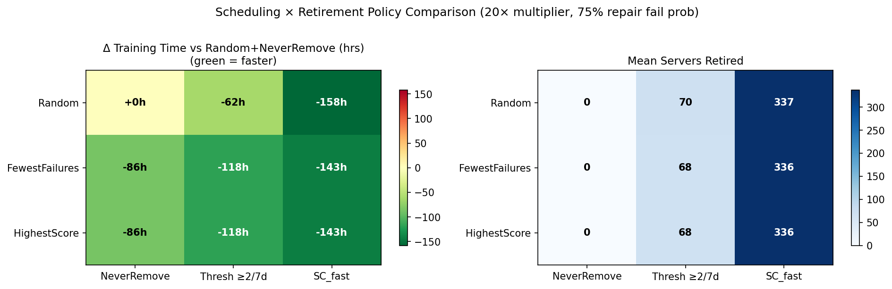
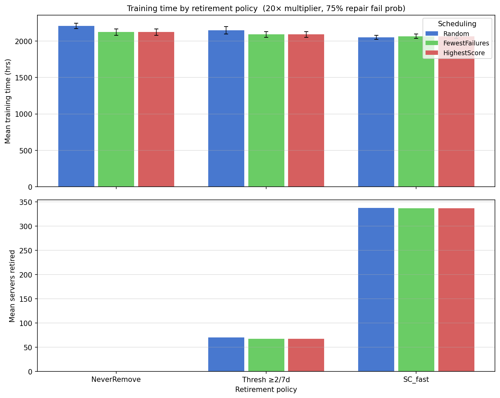
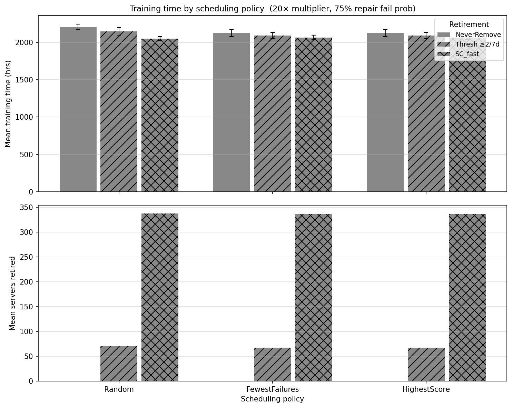

# Scheduling × Retirement Policy Comparison
## Does Smarter Scheduling Help — or Hurt?

---

## 1. Executive Summary

This report tests all 3×3 = 9 combinations of scheduling policy and retirement policy
in the payoff regime (20× failure multiplier, 75% manual repair fail probability,
4600-server pool).

**Key findings:**

- **`FewestFailuresFirst` and `HighestScoreFirst` are effectively identical** in this
  regime. They produce byte-for-byte matching training times across all retirement
  policies. The reason is structural: with credits inert at 4096-server scale,
  `ScoredRemoval` scores reduce to a monotone transformation of total failure count,
  so both policies impose the same ordering.

- **Smart scheduling alone (no retirement) saves 86h** by avoiding bad servers in the
  active job. This is a meaningful gain achievable with zero disruption to the pool.

- **`Random + ScoredRemoval` is the best overall combination (−158h vs baseline)** and
  beats every non-random scheduling + retirement combination.

- **Adding smart scheduling to `ScoredRemoval` makes things 15h *worse***, not better.
  The combination `FewestFailures/HighestScore + ScoredRemoval` saves only 143h,
  compared to 158h for `Random + ScoredRemoval`. This is an **antagonistic
  interaction**: smart scheduling delays retirement by starving bad servers of job
  time, slowing their failure accumulation and keeping them in the pool longer.

- **The two levers are partially substitutable**: smart scheduling and aggressive
  retirement each address the bad-server problem via different mechanisms. But when
  combined, they interfere — retirement works best when bad servers are given enough
  job time to reveal themselves quickly.

---

## 2. Simulation Regime

| Parameter | Value |
|---|---|
| `working_pool_size` | 4600 (488 above minimum 4112) |
| `spare_pool_size` | 200 |
| `job_size` | 4096 |
| `warm_standbys` | 16 |
| `job_length` | 14 days |
| `systematic_failure_rate_multiplier` | **20×** (bad TTF ≈ 2.4 days) |
| `systematic_failure_fraction` | 8% (≈ 368 bad servers) |
| `recovery_time` | 60 min |
| `manual_repair_fail_prob` | 0.75 (effective fix rate ≈ 28%) |
| Replications | 15 per cell |

**Baseline (Random + NeverRemove): 2208.7 ± 35.8 hrs**

---

## 3. Full Results Table

| Scheduling | Retirement | Mean (hrs) | Std | Δ vs baseline | Retired |
|---|---|---|---|---|---|
| Random | NeverRemove | 2208.7 | ±35.8 | 0.0h | 0 |
| Random | Thresh ≥2/7d | 2146.5 | ±49.7 | **−62.2h** | 70 |
| **Random** | **ScoredRemoval** | **2050.4** | **±28.7** | **−158.3h** | **337** |
| FewestFailures | NeverRemove | 2122.5 | ±45.2 | −86.2h | 0 |
| FewestFailures | Thresh ≥2/7d | 2090.4 | ±40.4 | −118.3h | 68 |
| FewestFailures | ScoredRemoval | 2065.9 | ±30.4 | −142.8h | 336 |
| HighestScore | NeverRemove | 2122.5 | ±45.2 | −86.2h | 0 |
| HighestScore | Thresh ≥2/7d | 2090.4 | ±40.4 | −118.3h | 68 |
| HighestScore | ScoredRemoval | 2065.9 | ±30.4 | −142.8h | 336 |

---

## 4. Visualisations

### 4.1 Heatmap



### 4.2 Grouped by Retirement Policy



### 4.3 Grouped by Scheduling Policy



---

## 5. Finding 1 — FewestFailuresFirst ≡ HighestScoreFirst in This Regime

The two non-random scheduling policies produce identical results (to the last decimal
place) across all three retirement policies.

**Reason:** `HighestScoreFirst` ranks servers by descending `ScoredRemoval` score.
`ScoredRemoval` score = `initial_score − failure_penalty × total_failures + credits`.
From the retirement policy analysis, uptime credits are **inert** at 4096-server scale
(mean run chunk ≈ 7 minutes; `time_period = 1 day`). Without credits:

```
score = initial_score − failure_penalty × total_failures
      = 100 − 60 × total_failures
```

This is a strictly decreasing linear function of `total_failures`. Ranking by
descending score is therefore identical to ranking by ascending failure count — exactly
what `FewestFailuresFirst` does. The two policies impose the same ordering on every
host-selection call, so simulation outcomes are identical.

**Consequence:** At 4096-server scale, `HighestScoreFirst` adds no information beyond
`FewestFailuresFirst`. Meaningful score-based differentiation from `FewestFailuresFirst`
would require either:
- Activating credits (set `time_period` to a few minutes), so that uptime history
  provides information beyond raw failure count, or
- A cluster small enough that individual servers have long uninterrupted run chunks.

---

## 6. Finding 2 — Smart Scheduling Without Retirement Saves 86h

Both `FewestFailuresFirst` and `HighestScoreFirst` with `NeverRemove` save **86h**
compared to `Random + NeverRemove` (2122.5h vs 2208.7h).

**Mechanism:** With ~368 bad servers in the pool (each failing every 2.4 days), random
selection assigns bad servers to the active job in proportion to their pool fraction
(~8%). Non-random selection pushes them to the back of the selection list. If there are
enough good servers to fill the 4112-server job without touching the bad ones, bad
servers sit idle and fail less often. Each avoided failure saves 60 minutes of
checkpoint recovery overhead.

This is the **scheduling defence**: avoid using bad servers rather than removing them.
At 8% bad fraction and 4600-server pool, there are enough good servers (4232 good) to
comfortably staff the job (4112 needed), so the bad servers are effectively benched.

---

## 7. Finding 3 — `Random + ScoredRemoval` Beats All Combinations

The best single combination is `Random + ScoredRemoval` at **2050.4h** (−158.3h vs
baseline). Every non-random scheduling + retirement combination falls short:

| Combination | Δ vs baseline |
|---|---|
| **Random + ScoredRemoval** | **−158.3h** |
| FewestFailures + ScoredRemoval | −142.8h |
| HighestScore + ScoredRemoval | −142.8h |
| FewestFailures + ThresholdRemoval | −118.3h |
| HighestScore + ThresholdRemoval | −118.3h |
| Random + ThresholdRemoval | −62.2h |
| FewestFailures + NeverRemove | −86.2h |
| HighestScore + NeverRemove | −86.2h |

---

## 8. Finding 4 — Antagonistic Interaction Between Smart Scheduling and Retirement

Adding `FewestFailuresFirst`/`HighestScoreFirst` to `ScoredRemoval` *reduces* the
benefit by 15.5h (from −158.3h to −142.8h). This is a **counter-intuitive negative
interaction**.

**Why smart scheduling undermines retirement:**

The `ScoredRemoval(SC_fast)` policy retires a server after 2 cumulative failures.
For a bad server (TTF ≈ 2.4 days) to accumulate 2 failures, it must be **in the active
job** during both failure events.

- With **random scheduling**, bad servers are assigned to the job proportionally. A bad
  server gets ~8% of all time slots on average, accruing failures at its full rate of
  ~0.18/day. It hits the 2-failure threshold in about 11 days (by which point it has
  been in the job for ~0.9 days). Retirement is fast and the pool cleans itself early
  in the simulation.

- With **non-random scheduling**, bad servers are deprioritized. They are assigned only
  when the queue of "good" servers is exhausted — which almost never happens with 4232
  good servers available for 4112 slots. Bad servers sit idle most of the time,
  accumulating failures slowly (only when they happen to get assigned). They persist in
  the pool much longer before hitting the 2-failure retirement threshold.

The net effect is that the pool stays dirtier for longer under non-random scheduling,
and the full −158h savings of clean-pool operation arrive later in the simulation or
not at all within the 14-day window.

In short: **retirement works fastest when bad servers are used the most** — and random
scheduling maximises bad-server utilisation.

---

## 9. The Decomposition of Savings

| Strategy | Δ vs Random+NeverRemove |
|---|---|
| Smart scheduling alone (FewestFailures/HighestScore + NeverRemove) | −86h |
| Retirement alone: ThresholdRemoval (Random) | −62h |
| Retirement alone: ScoredRemoval (Random) | −158h |
| Smart scheduling + ThresholdRemoval | −118h |
| Smart scheduling + ScoredRemoval | −143h |
| **Expected additive (86 + 158 = 244h)** | *not achieved* |

Smart scheduling and ScoredRemoval together save only 143h — far below the 86+158 = 244h
one might naively expect. The interaction is not merely sub-additive but actually
partially cancelling: smart scheduling erodes the retirement benefit (−158h → −143h
after adding it), while retirement erodes the scheduling benefit (−86h → −57h
incremental gain from scheduling when ScoredRemoval is already in use).

ThresholdRemoval also shows antagonism, but less severely: smart scheduling improves
ThresholdRemoval from −62h to −118h (+56h), while retirement improves smart scheduling
from −86h to −118h (+32h). Both gains are positive but sub-additive.

---

## 10. Practical Guidance

| Goal | Recommended combination | Rationale |
|---|---|---|
| Maximum training speed | `Random + ScoredRemoval(SC_fast)` | Retirement-driven pool cleaning, maximised by random scheduling |
| Avoid retirements entirely | `FewestFailures + NeverRemove` | Saves 86h purely via scheduling; zero pool disruption |
| Moderate retirement with scheduling boost | `FewestFailures + ThresholdRemoval(2/7d)` | Balanced: 118h savings, 68 retirements |
| Safety-first with headroom concern | `FewestFailures + NeverRemove` | No retirements, still saves 86h |

**When to use `HighestScoreFirst`:** At production scale (≥1000 servers), only when
`time_period` is set to minutes (matching actual run-chunk length) so that uptime history
genuinely differentiates servers from their failure count. With `time_period ≥ 1 hour`,
`HighestScoreFirst` is indistinguishable from `FewestFailuresFirst`.

---

*Generated by `examples/scheduling_comparison.py` — AIReSim v0.1.0*
