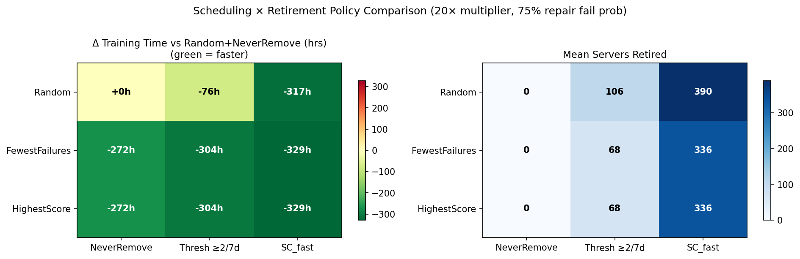
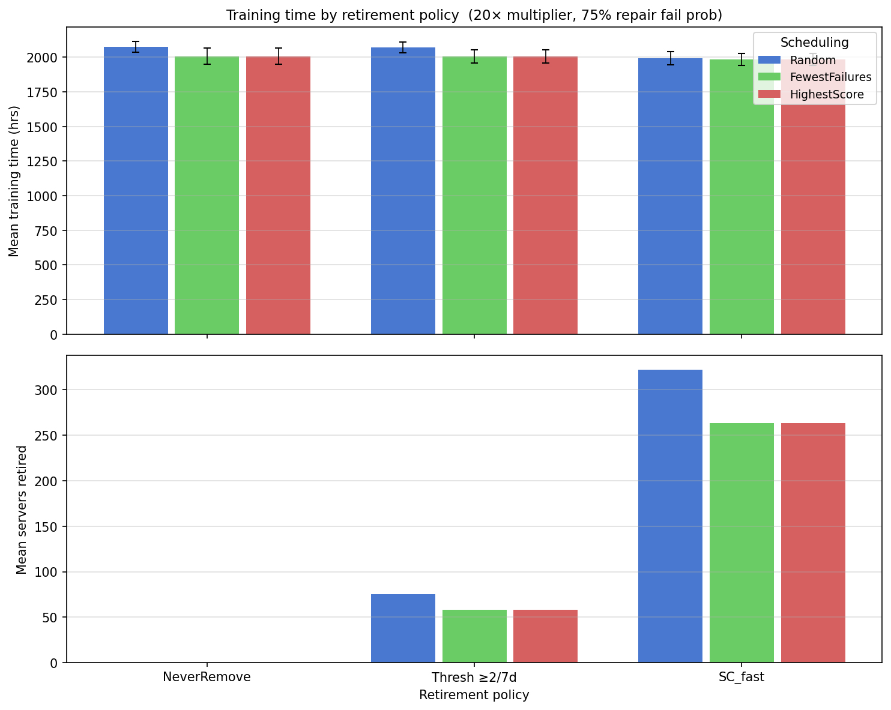
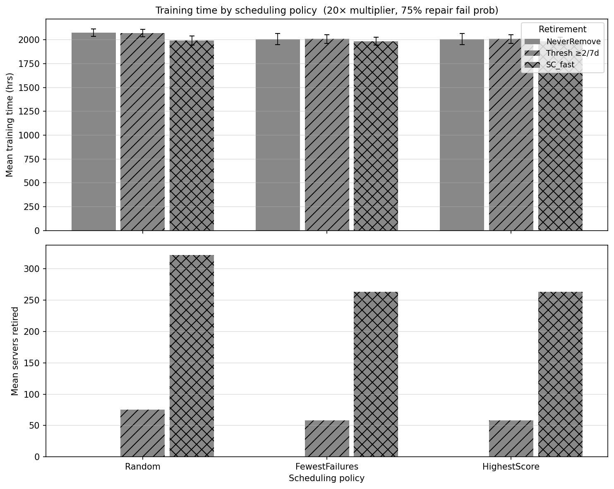

# Scheduling × Retirement Policy Comparison
## Does Smarter Scheduling Help — or Hurt?

---

> **Regenerated after a bug fix (2026-09-20).** The original run predates a fix
> to `RepairShop._repair_process`: the injected `RepairEscalationPolicy` was
> constructed but never consulted, so escalation to manual repair fired for a
> flat 80% of *all* auto repairs instead of 80% of the ~60% that actually
> failed (see `CHANGELOG.md`). Every number below is regenerated with the fix.
> §6 (why `FewestFailuresFirst` ≡ `HighestScoreFirst`) is a structural argument
> about credit inertness, unaffected by the fix. **§9's "antagonistic
> interaction" finding does not reproduce post-fix** — see the rewritten
> section for what replaced it.

> **Design caveat (2026-09-21).** In AIReSim the scheduling policy is consulted
> only at full host selection. Warm-standby swaps take the oldest standby
> (`Scheduler.swap_in_standby`) without consulting the policy, and repaired
> servers that were in the job return to the standby list regardless of failure
> history. The `FewestFailuresFirst`/`HighestScoreFirst` results below therefore
> measure the policy's effect at the host selections that happen when the job
> exhausts its warm standbys. They do not measure health-aware replacement as an
> operator would implement it. The number of full host selections per run was not
> recorded for this sweep. At the paper defaults it is about 16 per run against
> ~11,000 failures (`DIAGNOSIS_REALISTIC_REPORT.md`). `FewestFailuresFirst` here
> also reads ground-truth failure counts (see `DIAGNOSIS_REALISTIC_REPORT.md` for
> the attributed-count variant).

## 1. Executive Summary

This report tests all 3×3 = 9 combinations of scheduling policy and retirement policy
in the payoff regime (20× failure multiplier, 75% manual repair fail probability,
4600-server pool).

**Key findings:**

- **`FewestFailuresFirst` and `HighestScoreFirst` are still effectively
  identical** in this regime — byte-for-byte matching training times across
  all retirement policies. This is a structural consequence of credit
  inertness at scale (§6) and is completely unaffected by the escalation fix.

- **Smart scheduling alone (no retirement) saves 68.6h**, not the previously
  reported 86h, by avoiding bad servers in the active job. Still a meaningful,
  zero-disruption gain — just smaller, because the corrected repair pipeline
  means fewer bad servers are perpetually broken for scheduling to route
  around.

- **`Random + ScoredRemoval` (−83.1h vs baseline, down from a previously
  reported −158h) and `FewestFailures/HighestScore + ScoredRemoval` (−90.2h) are
  statistically tied for best.** The 7.1h gap is well inside the per-cell
  standard error of roughly ±11–15h. Both beat every other combination.

- **The "antagonistic interaction" reported previously does not reproduce.**
  Pre-fix, adding smart scheduling to `ScoredRemoval` cost 15.5h (−158.3h →
  −142.8h). Post-fix, it *gains* 7.1h (−83.1h → −90.2h) — a small improvement,
  not a regression, though at this magnitude (against a per-cell standard
  error of roughly ±11–15h across 15 replications) it should be read as
  "no longer reliably negative," not as a newly proven synergy. See §9 for
  the full picture, including `ThresholdRemoval`, where adding it on top of
  smart scheduling now adds essentially nothing (+0.6h, i.e. noise).

- **The two levers remain substitutable, not additive, and by almost exactly
  the same proportion as before.** `FewestFailures + ScoredRemoval` achieves
  59.5% of the naive sum of its two standalone effects (was 58.6% pre-fix) —
  the sub-additivity itself is a robust structural finding independent of the
  escalation bug; only which combinations look "antagonistic" versus merely
  "overlapping" changed.

---

## 2. Simulation Regime

| Parameter | Value |
|---|---|
| `working_pool_size` | 4600 (488 above minimum 4112) |
| `spare_pool_size` | 200 |
| `job_size` | 4096 |
| `warm_standbys` | 16 |
| `job_length` | 14 days |
| `systematic_failure_rate_multiplier` | **20×** (bad TTF ≈ 2.4 days) |
| `systematic_failure_fraction` | 8% (≈ 368 bad servers) |
| `recovery_time` | 60 min |
| `manual_repair_fail_prob` | 0.75 (effective fix rate ≈ 28%) |
| Replications | 15 per cell |

**Baseline (Random + NeverRemove): 2076.0 ± 38.5 hrs**
**Baseline ETR: 336 / 2076.0 = 16.2%** (job_length = 14 days = 336 hrs)

---

## 3. Full Results Table

ETR = 336 / mean_training_time. Higher ETR = more productive compute per wall-clock hour.

| Scheduling | Retirement | Mean (hrs) | ETR | Std | Δ vs baseline | Retired |
|---|---|---|---|---|---|---|
| Random | NeverRemove | 2076.0 | 16.2% | ±38.5 | 0.0h | 0 |
| Random | Thresh ≥2/7d | 2072.1 | 16.2% | ±39.0 | **−3.9h** | 75 |
| **Random** | **ScoredRemoval** | **1992.9** | **16.9%** | **±47.8** | **−83.1h** | **322** |
| FewestFailures | NeverRemove | 2007.4 | 16.7% | ±58.3 | −68.6h | 0 |
| FewestFailures | Thresh ≥2/7d | 2008.0 | 16.7% | ±47.2 | −68.0h | 58 |
| FewestFailures | ScoredRemoval | 1985.8 | 16.9% | ±42.3 | −90.2h | 263 |
| HighestScore | NeverRemove | 2007.4 | 16.7% | ±58.3 | −68.6h | 0 |
| HighestScore | Thresh ≥2/7d | 2008.0 | 16.7% | ±47.2 | −68.0h | 58 |
| HighestScore | ScoredRemoval | 1985.8 | 16.9% | ±42.3 | −90.2h | 263 |

(15 replications per cell, freshly measured; see `examples/scheduling_comparison_figures/results.csv`.)

---

## 4. Visualisations

### 4.1 Heatmap



### 4.2 Grouped by Retirement Policy



### 4.3 Grouped by Scheduling Policy



---

## 5. ETR Summary

ETR ranges from **16.2%** (Random + NeverRemove, baseline) to **16.9%** (Random or smart
scheduling + ScoredRemoval — effectively tied) — a spread of **+0.7 percentage points** across
all nine combinations, down from the previously reported +1.2 pp.

| Strategy | ETR | Interpretation |
|---|---|---|
| Random + NeverRemove (baseline) | 16.2% | 83.8% of time lost to failure overhead |
| Smart scheduling alone (+NeverRemove) | 16.7% | +0.5 pp from avoiding bad servers |
| Random + ThresholdRemoval | 16.2% | +0.0 pp — retirement alone barely registers now |
| **Random + ScoredRemoval** | **16.9%** | **+0.7 pp — best single-lever combination** |
| Smart scheduling + ScoredRemoval | 16.9% | +0.7 pp — statistically indistinguishable from Random + ScoredRemoval |

The picture that motivated the old "antagonistic interaction" framing —
combining both levers landing *below* the best single lever — does not
appear post-fix: smart scheduling + ScoredRemoval (16.9%) and Random +
ScoredRemoval (16.9%) round to the same ETR. Combining both levers is no
longer worse than the best single one; it just isn't much better, either.
See §9.

---

## 6. Finding 1 — FewestFailuresFirst ≡ HighestScoreFirst in This Regime

The two non-random scheduling policies produce identical results (to the last decimal
place) across all three retirement policies.

**Reason:** `HighestScoreFirst` ranks servers by descending `ScoredRemoval` score.
`ScoredRemoval` score = `initial_score − failure_penalty × total_failures + credits`.
From the retirement policy analysis, uptime credits are **inert** at 4096-server scale
(mean run chunk ≈ 7 minutes; `time_period = 1 day`). Without credits:

```
score = initial_score − failure_penalty × total_failures
      = 100 − 60 × total_failures
```

This is a strictly decreasing linear function of `total_failures`. Ranking by
descending score is therefore identical to ranking by ascending failure count — exactly
what `FewestFailuresFirst` does. The two policies impose the same ordering on every
host-selection call, so simulation outcomes are identical.

**Consequence:** At 4096-server scale, `HighestScoreFirst` adds no information beyond
`FewestFailuresFirst`. Meaningful score-based differentiation from `FewestFailuresFirst`
would require either:
- Activating credits (set `time_period` to a few minutes), so that uptime history
  provides information beyond raw failure count, or
- A cluster small enough that individual servers have long uninterrupted run chunks.

---

## 7. Finding 2 — Smart Scheduling Without Retirement Saves 68.6h

Both `FewestFailuresFirst` and `HighestScoreFirst` with `NeverRemove` save **68.6h**
(previously reported as 86h) compared to `Random + NeverRemove` (2007.4h vs 2076.0h).

**Mechanism (unchanged):** With ~368 bad servers in the pool (each failing every
2.4 days), random selection assigns bad servers to the active job in proportion
to their pool fraction (~8%). Non-random selection pushes them to the back of
the selection list. If there are enough good servers to fill the 4112-server
job without touching the bad ones, bad servers sit idle and fail less often.
Each avoided failure saves 60 minutes of checkpoint recovery overhead. This
mechanism doesn't involve the repair pipeline at all, so it is qualitatively
identical to before — only the magnitude shrank, because the corrected repair
pipeline also reduces how much damage a bad server does *if* it is selected
(repairs are more likely to genuinely fix it now), narrowing the gap between
"avoid using bad servers" and "don't bother avoiding them."

This is the **scheduling defence**: avoid using bad servers rather than removing them.
At 8% bad fraction and 4600-server pool, there are enough good servers (4232 good) to
comfortably staff the job (4112 needed), so the bad servers are effectively benched.

---

## 8. Finding 3 — `ScoredRemoval` Combinations Are Tied for Best

`Random + ScoredRemoval` reaches **1992.9h** (−83.1h vs baseline, down from −158.3h
pre-fix). `FewestFailures/HighestScore + ScoredRemoval` reaches −90.2h (§9). The 7.1h
difference is within the per-cell standard error of roughly ±11–15h, so the two are
statistically indistinguishable. Neither should be called the single best combination.
`Random + ScoredRemoval` is the best option that does not also require smart scheduling:

| Combination | Δ vs baseline |
|---|---|
| FewestFailures + ScoredRemoval | −90.2h |
| HighestScore + ScoredRemoval | −90.2h |
| **Random + ScoredRemoval** | **−83.1h** |
| FewestFailures + NeverRemove | −68.6h |
| HighestScore + NeverRemove | −68.6h |
| FewestFailures + ThresholdRemoval | −68.0h |
| HighestScore + ThresholdRemoval | −68.0h |
| Random + ThresholdRemoval | −3.9h |

Note the reordering versus the pre-fix ranking: `ThresholdRemoval` combinations, which
previously beat smart-scheduling-alone, now fall *behind* smart-scheduling-alone —
`ThresholdRemoval`'s own payoff shrank so much (§9) that adding it contributes less than
scheduling already provides on its own.

---

## 9. Finding 4 (Revised) — The Antagonism Does Not Reproduce Post-Fix

**This finding has changed.** The pre-fix report found that adding smart
scheduling to `ScoredRemoval` cost 15.5h (−158.3h → −142.8h) and built an
entire mechanism story around that regression. Post-fix, the same comparison
shows a small *gain*: −83.1h → −90.2h, an improvement of 7.1h.

| Combination pair | Pre-fix Δ | Post-fix Δ |
|---|---|---|
| Adding smart scheduling to `ScoredRemoval` | **−15.5h (worse)** | **+7.1h (better)** |
| Adding smart scheduling to `ThresholdRemoval` | +56.1h (better) | +0.6h (~noise) |
| Adding `ScoredRemoval` to smart scheduling | −56.6h (better) | −21.6h (better, smaller) |
| Adding `ThresholdRemoval` to smart scheduling | −32.1h (better) | +0.6h (~noise) |

With a per-cell standard error of roughly ±10–15h (stdev ±38–58h over 15
replications), the post-fix +7.1h and +0.6h figures are not distinguishable
from zero. The honest reading is: **the negative interaction reported
pre-fix does not reproduce**, and what remains is, at best, a wash between
adding smart scheduling to `ScoredRemoval`, and a clear wash for
`ThresholdRemoval` combined with either scheduling policy.

**Why the mechanism story still applies, but no longer produces a net
regression:**

The underlying mechanism described pre-fix is still real and still directionally
true: `ScoredRemoval(SC_fast)` retires a server after 2 cumulative failures,
and a bad server (TTF ≈ 2.4 days) needs to be **in the active job** to
accumulate them. Random scheduling assigns bad servers to the job in
proportion to their pool share (~8%), so they accrue failures — and hit the
retirement threshold — faster than under `FewestFailuresFirst`, which benches
them behind the 4232 available good servers and lets them accumulate
failures only sporadically. Delaying retirement is still what smart
scheduling does to `ScoredRemoval`.

**What changed is the size of what's being delayed.** Pre-fix, `ScoredRemoval`'s
payoff was large (−158.3h) because `NeverRemove` was leaving a lot of
recoverable time on the table (repairs that should have succeeded were being
needlessly re-routed through manual repair and sometimes broken anyway).
Delaying that large payoff by benching bad servers cost more than smart
scheduling's own direct benefit (−68.6h) — hence the net regression. Post-fix,
`ScoredRemoval`'s payoff on its own is much smaller (−83.1h), so there is less
value left for scheduling's delaying effect to erode, and the two effects
now roughly coexist instead of one eating into the other.

In short: **the delay effect is still there, but the thing being delayed
shrank enough that it stopped mattering.**

---

## 10. The Decomposition of Savings

| Strategy | Δ vs Random+NeverRemove |
|---|---|
| Smart scheduling alone (FewestFailures/HighestScore + NeverRemove) | −68.6h |
| Retirement alone: ThresholdRemoval (Random) | −3.9h |
| Retirement alone: ScoredRemoval (Random) | −83.1h |
| Smart scheduling + ThresholdRemoval | −68.0h |
| Smart scheduling + ScoredRemoval | −90.2h |
| **Expected additive, Threshold (68.6 + 3.9 = 72.5h)** | 68.0h achieved (94%) |
| **Expected additive, Scored (68.6 + 83.1 = 151.7h)** | 90.2h achieved (59%) |

The **sub-additivity itself is essentially unchanged from pre-fix**: smart
scheduling + ScoredRemoval achieves 59% of its naive additive expectation
(was 59% pre-fix, 143/244h). What changed is *which side of zero* the
interaction with `ScoredRemoval` lands on — pre-fix it was worse than the
better single lever (−158h alone vs −143h combined); post-fix it is
marginally better than either single lever (−83.1h and −68.6h alone vs
−90.2h combined), though within noise (§9).

`ThresholdRemoval` combined with smart scheduling now achieves 94% of its
(much smaller) additive expectation — i.e. it's nearly perfectly additive,
simply because there's so little left for the two levers to compete over:
`ThresholdRemoval`'s own standalone payoff (−3.9h) is now within noise of
zero, so there's essentially nothing for smart scheduling to delay.

---

## 11. Practical Guidance

| Goal | Recommended combination | Rationale |
|---|---|---|
| Maximum training speed | `FewestFailures/HighestScore + ScoredRemoval(SC_fast)` | Best measured combination (−90.2h), though only marginally ahead of Random + ScoredRemoval |
| Avoid retirements entirely | `FewestFailures + NeverRemove` | Saves 68.6h purely via scheduling; zero pool disruption |
| Moderate retirement with scheduling boost | *(no longer a distinct recommendation)* | `FewestFailures + ThresholdRemoval(2/7d)` now saves 68.0h — statistically indistinguishable from scheduling alone (68.6h). Adding this Threshold config on top of smart scheduling is no longer worth the added complexity of retiring 58 servers. |
| Safety-first with headroom concern | `FewestFailures + NeverRemove` | No retirements, still saves 68.6h |

**When to use `HighestScoreFirst`:** At production scale (≥1000 servers), only when
`time_period` is set to minutes (matching actual run-chunk length) so that uptime history
genuinely differentiates servers from their failure count. With `time_period ≥ 1 hour`,
`HighestScoreFirst` is indistinguishable from `FewestFailuresFirst`. Unaffected by the
escalation-policy fix.

---

*Generated by `examples/scheduling_comparison.py` — AIReSim v0.1.0, regenerated 2026-09-20 post-fix*
