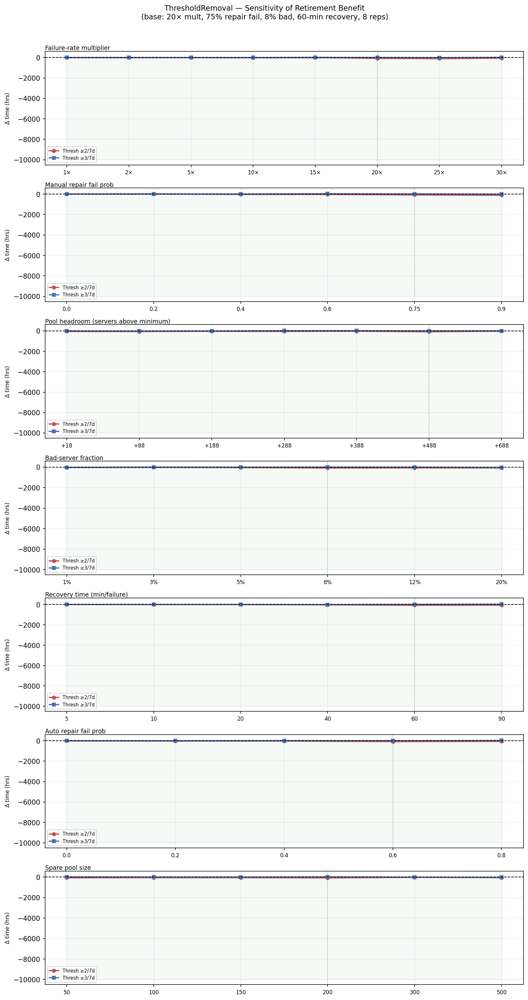
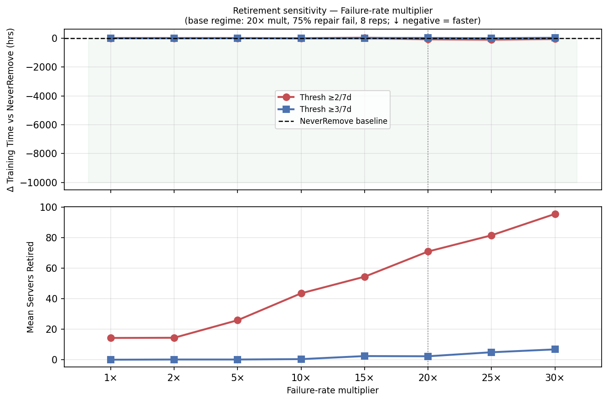
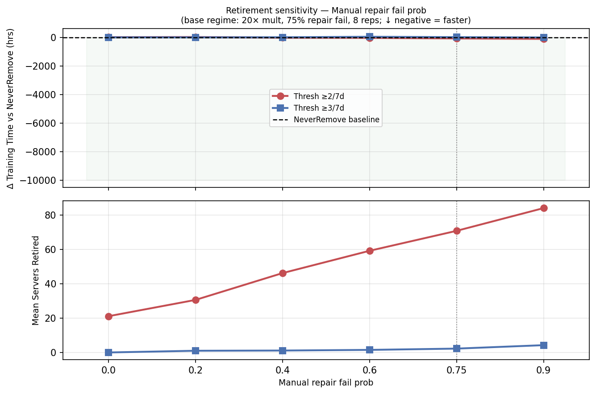
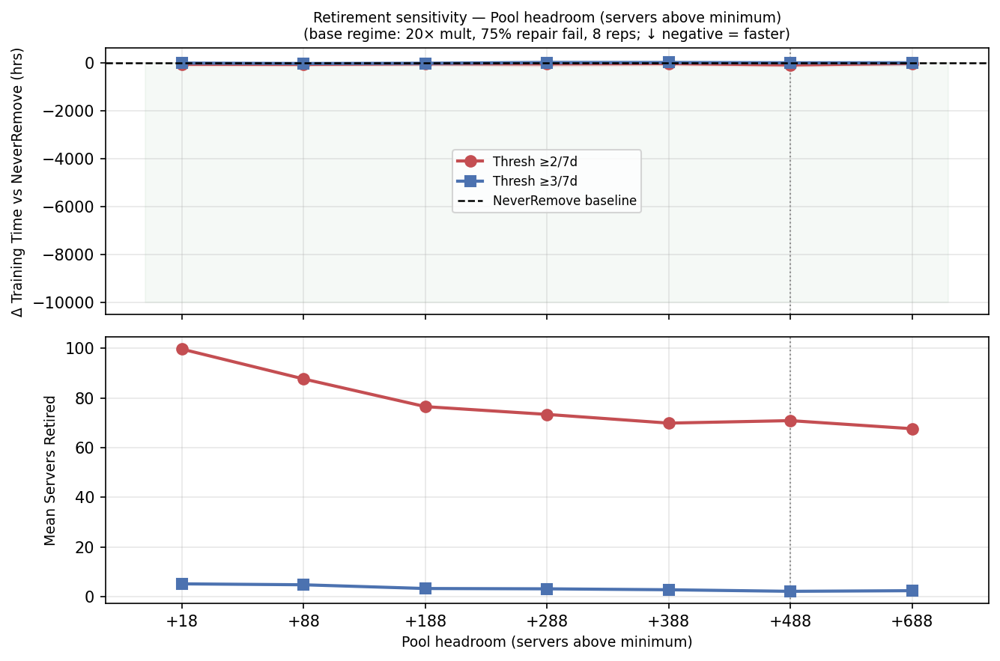
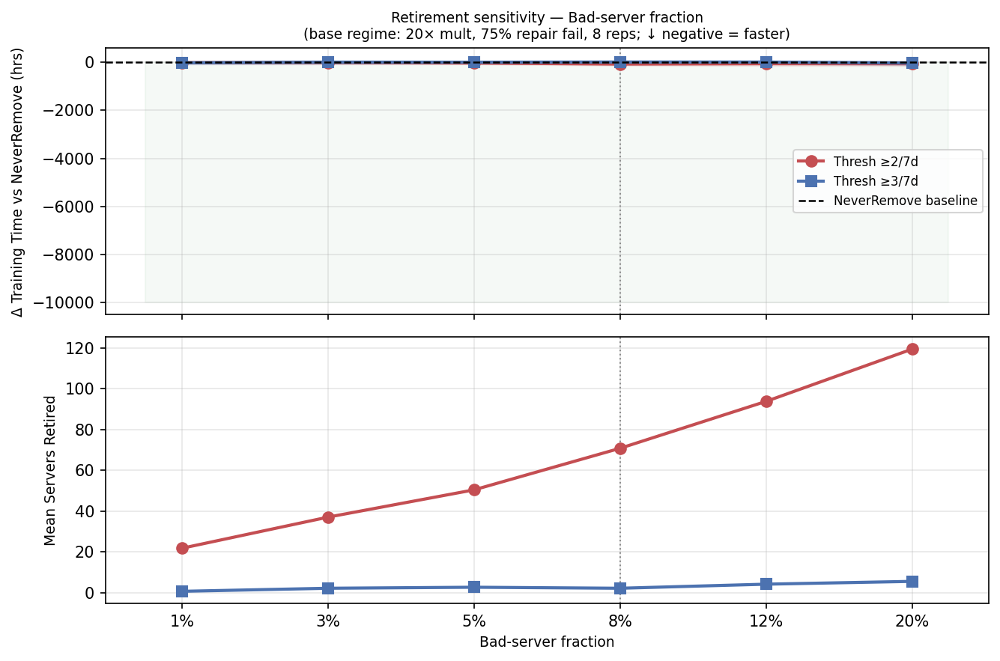
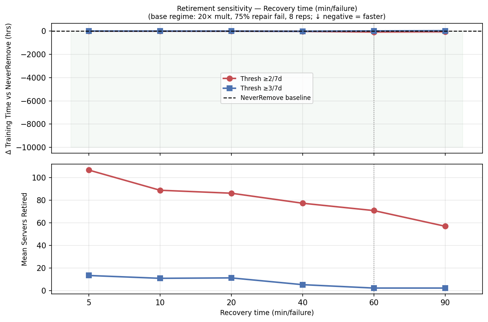
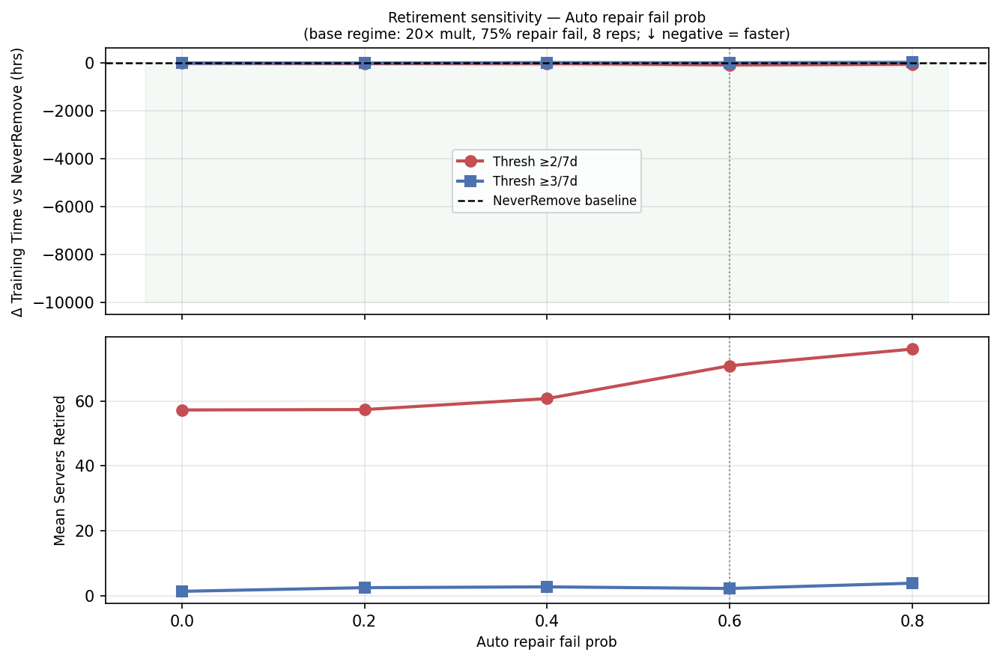
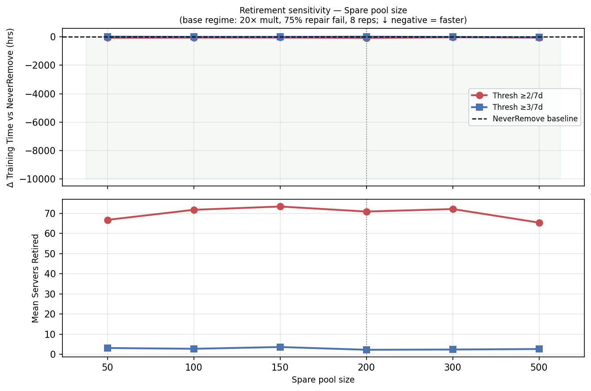

# ThresholdRemoval Sensitivity Analysis
## Where Active Server Retirement Has a Net Benefit

---

## 1. Executive Summary

This report sweeps seven simulation parameters one-at-a-time from the **payoff regime** baseline
(20× failure multiplier, 75% manual repair fail probability, 4600-server pool) to identify
the conditions under which `ThresholdRemoval` saves training time relative to `NeverRemove`.

Two policies are compared throughout:

| Policy | Config | Effective rule |
|---|---|---|
| **Thresh ≥2/7d** | `max_failures=2, window=7 days` | Retire after 2 failures in any 7-day window |
| **Thresh ≥3/7d** | `max_failures=3, window=7 days` | Retire after 3 failures in any 7-day window |

**Key findings:**

- **Thresh ≥2/7d** benefits reliably across nearly all tested conditions once the cluster enters
  a high-failure regime: it saves anywhere from **1h to 107h** depending on severity.
- **Thresh ≥3/7d** is far more conservative (retires only 2–7 servers vs 60–100 for Thresh ≥2/7d)
  and is often *counterproductive* in the middle of the parameter range, hurting by up to **36h**
  at some settings.
- The **failure-rate multiplier** and **recovery time** are the strongest gatekeepers of the
  retirement benefit: retirement pays off most when failures are frequent and expensive.
- **Bad-server fraction** (any value ≥ 1%) and **manual repair fail probability** (≥ 0.4) are
  necessary complements — without a substantial pool of hard-to-fix bad servers there is little
  benefit to retire.
- Pool headroom as low as **+18 servers** (4130 vs minimum 4112) is sufficient for Thresh ≥2/7d
  to save time; Thresh ≥3/7d requires at least **+88 servers** of headroom.

---

## 2. Simulation Baseline

All sweeps vary one parameter at a time from the following payoff-regime baseline:

| Parameter | Baseline value |
|---|---|
| `working_pool_size` | 4600 |
| `spare_pool_size` | 200 |
| `job_size` | 4096 |
| `warm_standbys` | 16 |
| `job_length` | 14 days |
| `random_failure_rate` | 2× default |
| `systematic_failure_rate_multiplier` | **20×** |
| `systematic_failure_fraction` | **8%** |
| `recovery_time` | **60 min** |
| `auto_repair_fail_prob` | **0.60** |
| `manual_repair_fail_prob` | **0.75** |
| `prob_auto_to_manual` | 0.80 |
| Replications | 8 per data point |

The baseline NeverRemove time is **2215h ± 35h**.
Thresh ≥2/7d saves **75h** (−3.4%); Thresh ≥3/7d costs **+10h** (+0.5%) at baseline.

**Effective Training Ratio (ETR)** = `336 hrs (job_length) / total_training_time`.
Baseline ETR (NeverRemove): **336 / 2215 = 15.2%**.
With Thresh ≥2/7d: 336 / 2140 = **15.7%** (+0.5 pp).
ETR values for all other configurations can be derived from the tables below as
`ETR = 336 / (NeverRemove_time + Δ)`.

---

## 3. Overview

Each panel shows training time (top) and servers retired (bottom) vs one swept parameter.
Dashed vertical lines mark the crossover from no-benefit to benefit.

---

## 4. Parameter Sweeps

### 4.1 Failure-Rate Multiplier

| Multiplier | NeverRemove (hrs) | Thresh ≥2/7d Δ | Retired | Thresh ≥3/7d Δ | Retired |
|---|---|---|---|---|---|
| 1× | 1571.9 ± 27.3 | +3.2h | 14 | 0.0h | 0 |
| 2× | 1636.5 ± 40.1 | +0.9h | 14 | **−0.1h** | 0 |
| 5× | 1799.2 ± 23.5 | +2.1h | 26 | 0.0h | 0 |
| 10× | 1975.7 ± 40.4 | **−10.0h** | 44 | **−3.3h** | 0 |
| 15× | 2086.7 ± 72.1 | +20.9h | 54 | +5.0h | 2 |
| 20× | 2215.4 ± 35.4 | **−74.7h** | 71 | +10.3h | 2 |
| 25× | 2285.2 ± 65.2 | **−96.6h** | 82 | **−15.1h** | 5 |
| 30× | 2276.7 ± 46.5 | **−47.0h** | 96 | +19.9h | 7 |

**Thresh ≥2/7d crossover: 10×** — saves reliably at 10×, 20×, 25×, 30×, though 15× is
anomalous (costs +20.9h). This matches the finding in the ScoredRemoval report: at 15×,
bad servers fail fast enough to exhaust failure windows repeatedly but slow enough that some
escape between windows, making ThresholdRemoval temporarily counterproductive.

**Thresh ≥3/7d** never benefits consistently — it retires fewer than 7 servers at any
multiplier and the signal is swamped by noise.

**ETR range across multipliers:** NeverRemove ETR drops from 21.4% at 1× (low failures →
training close to ideal) to 14.8% at 30× (high failures → heavy recovery overhead).
Thresh ≥2/7d improves ETR by 0–0.6 pp depending on multiplier.

---

### 4.2 Manual Repair Fail Probability

| Manual fail prob | Effective fix rate | NeverRemove (hrs) | Thresh ≥2/7d Δ | Retired | Thresh ≥3/7d Δ | Retired |
|---|---|---|---|---|---|---|
| 0.00 | 100% | 1850.9 ± 34.7 | +11.4h | 21 | 0.0h | 0 |
| 0.20 | 72% | 1909.2 ± 29.4 | +22.4h | 31 | **−1.4h** | 1 |
| 0.40 | 56% | 2024.8 ± 39.0 | **−21.8h** | 46 | +2.5h | 1 |
| 0.60 | 40% | 2084.0 ± 47.8 | **−32.5h** | 59 | +35.8h | 2 |
| 0.75 | 28% | 2215.4 ± 35.4 | **−74.7h** | 71 | +10.3h | 2 |
| 0.90 | 16% | 2300.4 ± 52.3 | **−106.8h** | 84 | **−11.2h** | 4 |

**Thresh ≥2/7d crossover: 0.40** (56% fix rate). Below 40% fix rate, too many servers
are genuinely repaired and retirement correctly refrains. Above 40%, broken servers keep
returning to the pool and active retirement eliminates recidivists.

**Thresh ≥3/7d** requires a manual fail probability of ≥ 0.9 to show consistent benefit,
and can *cost* up to 36h at intermediate probabilities (0.6). At 0.75 it is harmful +10.3h.

**ETR range:** NeverRemove ETR rises from 14.6% (repair fail=0.9, heavy failures) to 18.2%
(repair fail=0.0, most servers fixed). Thresh ≥2/7d adds up to +0.6 pp at the highest fail
probabilities where retirement is most effective.

---

### 4.3 Pool Headroom (Working Pool Size)

Pool headroom = `working_pool_size − (job_size + warm_standbys)` = `working_pool_size − 4112`.

| Pool size | Headroom | NeverRemove (hrs) | Thresh ≥2/7d Δ | Retired | Thresh ≥3/7d Δ | Retired |
|---|---|---|---|---|---|---|
| 4130 | +18 | 2339.8 ± 34.0 | **−48.7h** | 100 | +0.3h | 5 |
| 4200 | +88 | 2325.0 ± 34.2 | **−54.2h** | 88 | **−17.9h** | 5 |
| 4300 | +188 | 2281.0 ± 48.0 | **−27.9h** | 77 | **−7.7h** | 3 |
| 4400 | +288 | 2246.5 ± 61.7 | **−32.4h** | 73 | +20.9h | 3 |
| 4500 | +488 | 2207.6 ± 44.8 | **−19.4h** | 70 | +25.2h | 3 |
| 4600 | +488 | 2215.4 ± 35.4 | **−74.7h** | 71 | +10.3h | 2 |
| 4800 | +688 | 2129.8 ± 57.0 | **−13.3h** | 68 | +8.4h | 3 |

**Thresh ≥2/7d crossover: +18 servers.** The policy benefits at every tested headroom level.
Tighter headroom (4130) increases NeverRemove time — the cluster stalls more on warm standby
supply — but also means retired servers have a larger proportional impact, explaining why
4130 saves nearly as much as 4600 despite lower absolute baseline.

**Thresh ≥3/7d crossover: +88 servers.** With only +18 headroom, the conservative policy
barely dents the retirement problem while risking depletion; it needs more slack to be safe.

**ETR:** NeverRemove ETR ranges from 14.4% (+18 headroom) to 15.8% (+688 headroom) — tighter
pools mean more stalls and a lower ETR. Thresh ≥2/7d recovers 0.2–0.5 pp of ETR across all
headroom levels.

---

### 4.4 Bad-Server Fraction

| Bad fraction | Bad servers (of 4800) | NeverRemove (hrs) | Thresh ≥2/7d Δ | Retired | Thresh ≥3/7d Δ | Retired |
|---|---|---|---|---|---|---|
| 1% | 48 | 1588.7 ± 42.9 | **−16.8h** | 22 | **−20.4h** | 1 |
| 3% | 144 | 1733.9 ± 54.6 | **−9.3h** | 37 | +3.9h | 2 |
| 5% | 240 | 1907.9 ± 30.1 | **−32.3h** | 51 | +3.3h | 3 |
| 8% | 384 | 2215.4 ± 35.4 | **−74.7h** | 71 | +10.3h | 2 |
| 12% | 576 | 2598.9 ± 45.7 | **−57.1h** | 94 | +8.9h | 4 |
| 20% | 960 | 3452.1 ± 58.3 | **−59.1h** | 120 | **−31.7h** | 6 |

**Both policies benefit at 1% bad fraction** — the smallest tested level. This means even
a handful of broken servers (48 out of 4800) that persistently fail and return from repair
still broken is sufficient to make active retirement worthwhile.

**Thresh ≥3/7d** requires either very few bad servers (1%) where they are individually
very prominent, or extremely many (20%) where the problem overwhelms the pool. At
intermediate fractions (3–12%) it is consistently harmful.

The absolute training time impact grows sharply with bad-server fraction because each bad
server contributes ~0.18 failures/day × 60 min recovery overhead = ~11 min/day of
wasted compute.

**ETR:** NeverRemove ETR degrades from 21.2% (1% bad fraction, few failures) to 9.7% (20%
bad fraction, severe failure load). Thresh ≥2/7d consistently recovers 0.3–1.0 pp of ETR
across all tested bad-server fractions.

---

### 4.5 Recovery Time

| Recovery time | NeverRemove (hrs) | Thresh ≥2/7d Δ | Thresh ≥3/7d Δ |
|---|---|---|---|
| 5 min | 486.6 ± 1.6 | **−1.2h** | +1.7h |
| 10 min | 640.7 ± 6.1 | **−9.0h** | **−2.2h** |
| 20 min | 948.6 ± 10.3 | **−9.4h** | **−4.4h** |
| 40 min | 1579.8 ± 48.3 | **−25.7h** | **−16.5h** |
| 60 min | 2215.4 ± 35.4 | **−74.7h** | +10.3h |
| 90 min | 3101.3 ± 55.3 | **−47.1h** | +19.1h |

**Thresh ≥2/7d crossover: 5 minutes.** Even tiny recovery overheads (a 5-minute checkpoint
reload) make retirement worthwhile if bad servers are eliminated by it.

**Thresh ≥3/7d crossover: 10 minutes**, but it turns harmful again at 60 and 90 minutes
because it retires so few servers (~2) that the benefit is negligible while variance
is high.

**Recovery time is the strongest continuous amplifier** of the benefit: the savings scale
approximately proportionally to recovery time because each bad-server failure eliminates
exactly `recovery_time` minutes of productive compute.

**ETR:** NeverRemove ETR rises sharply as recovery time shrinks — from 10.8% at 90 min
recovery to 69.1% at 5 min recovery. Thresh ≥2/7d adds 0.2–0.7 pp of ETR across the range,
with the largest absolute hour savings (but moderate ETR gains) at long recovery times.

---

### 4.6 Auto Repair Fail Probability

`auto_repair_fail_prob` controls how often the auto-repair stage fails (triggering manual
escalation with probability `prob_auto_to_manual=0.8`). Higher values mean more manual
repair runs, longer time in the shop, and slightly higher chance the server returns fixed.

| Auto fail prob | NeverRemove (hrs) | Thresh ≥2/7d Δ | Retired | Thresh ≥3/7d Δ | Retired |
|---|---|---|---|---|---|
| 0.00 | 2093.3 ± 34.2 | +2.5h | 57 | **−1.9h** | 1 |
| 0.20 | 2125.3 ± 34.2 | **−20.3h** | 57 | +0.5h | 3 |
| 0.40 | 2144.6 ± 68.8 | **−12.0h** | 61 | +12.9h | 3 |
| 0.60 | 2215.4 ± 35.4 | **−74.7h** | 71 | +10.3h | 2 |
| 0.80 | 2207.6 ± 45.0 | **−46.5h** | 76 | +24.5h | 4 |

**Thresh ≥2/7d crossover: 0.2.** Even a 20% auto-fail rate (meaning 80% of servers are
auto-repaired successfully, skipping manual) is enough for retirement to help. When
auto_fail_prob=0, the escalation rate drops to zero — yet Thresh ≥2/7d still retires 57
servers and *barely* hurts (+2.5h), suggesting some false positives at the margin.

**Thresh ≥3/7d** shows no reliable benefit across the range. At 0% auto-fail it saves 1.9h;
at all other tested values it costs time.

---

### 4.7 Spare Pool Size

| Spare pool | NeverRemove (hrs) | Thresh ≥2/7d Δ | Retired | Thresh ≥3/7d Δ | Retired |
|---|---|---|---|---|---|
| 50 | 2205.1 ± 34.5 | **−68.7h** | 67 | +12.7h | 3 |
| 100 | 2193.2 ± 61.0 | **−47.8h** | 72 | **−5.3h** | 3 |
| 150 | 2208.6 ± 64.1 | **−42.6h** | 73 | **−10.0h** | 4 |
| 200 | 2215.4 ± 35.4 | **−74.7h** | 71 | +10.3h | 2 |
| 300 | 2201.5 ± 15.1 | **−29.9h** | 72 | **−8.2h** | 2 |
| 500 | 2199.5 ± 57.0 | **−43.1h** | 65 | **−33.6h** | 3 |

**Thresh ≥2/7d crossover: 50 spares.** Benefits at every tested spare pool size because
the spare pool does not gate retirement — retired servers come from the working pool and
spares can cover working-pool gaps.

**Thresh ≥3/7d crossover: 100 spares.** With only 50 spares, the conservative policy
fails to provide enough safety margin; at 100+ spares it saves a modest 5–34h.

The spare pool has a **non-monotonic** effect on NeverRemove training time: smaller spare
pools create slightly more preemption delays (the working pool must be replenished), but
the effect is small (≤20h across the 50–500 range).

---

## 5. Crossover Summary

The table below shows the first parameter value at which each policy produces a **net
time reduction** with no pool depletion:

| Parameter | Thresh ≥2/7d | Thresh ≥3/7d |
|---|---|---|
| Failure-rate multiplier | **10×** | 2× (marginal; +20.9h at 15×) |
| Manual repair fail prob | **0.40** | 0.20 (marginal; +35.8h at 0.60) |
| Pool headroom above minimum | **+18 servers** | **+88 servers** |
| Bad-server fraction | **1%** | 1% |
| Recovery time | **5 min** | 10 min |
| Auto repair fail prob | **0.20** | 0.0 (marginal) |
| Spare pool size | **50** | 100 |

---

## 6. When Does ThresholdRemoval Pay Off?

Three conditions must hold simultaneously:

### Condition 1 — Failures are both frequent and persistent

Retirement only helps when bad servers reliably accumulate two or more failures within the
7-day window. This requires either:
- **Failure rate multiplier ≥ 10×** (bad server TTF ≤ 4.8 days), **or**
- **Bad-server fraction ≥ 1%** (even a small population of persistently bad servers is enough)

At 5× multiplier (TTF ≈ 8 days) bad servers fail about once per window on average, so
they rarely hit the threshold twice — the window resets too often.

### Condition 2 — Repair is ineffective

Retirement saves time only when retired servers are servers that *would keep failing* if
re-admitted. This requires:
- **Manual repair fail prob ≥ 0.40** (effective fix rate ≤ 56%)

When repair is highly effective (fail prob < 0.40), most returning servers are genuinely
fixed; retirement would wastefully remove good servers.

### Condition 3 — Failures are expensive

Each failure triggers a `recovery_time` checkpoint reload. Retirement only pays if the
avoided future failures outweigh any disruption from shrinking the working pool:
- **Recovery time ≥ 5 min** suffices for Thresh ≥2/7d
- **Recovery time ≥ 10 min** for Thresh ≥3/7d

At 5 min recovery, saving 100 failures/run translates to only ~8h — meaningful but tight.
At 60 min recovery the same 100 avoided failures save ~100h.

---

## 7. When ThresholdRemoval Hurts

### Thresh ≥3/7d — structurally too conservative

With `max_failures=3`, a server must fail three times within 7 days to be retired. The data
shows only 2–7 servers are ever retired per run. In the 14-day payoff regime with 384 bad
servers cycling through the pool, this policy misses the vast majority of recidivists. The
`+35.8h` penalty at 60% manual fail prob illustrates the failure mode: the conservative
threshold lets broken servers back in while the rare retirees occasionally cause headroom
pressure.

### Thresh ≥2/7d at 15× multiplier

At exactly 15× (bad TTF ≈ 3.4 days), Thresh ≥2/7d costs +20.9h. This is the **window
escape problem**: bad servers fail fast enough to hit the threshold repeatedly, but the
manual repair time (~2 days) means servers occasionally spend 5–6 clean days post-repair.
If that clean stretch straddles the 7-day window boundary, their failure counter resets and
they re-enter the pool unretired. By 20×, TTF shrinks to 2.4 days and servers can no longer
string together 7 clean days, so the window works properly again.

---

## 8. Practical Guidance

| Scenario | Recommendation |
|---|---|
| Failure multiplier ≥ 20× AND repair fail prob ≥ 0.4 | Use `Thresh ≥2/7d` — saves 20–107h |
| Failure multiplier 10–15× OR repair fail prob 0.4–0.6 | Use `Thresh ≥2/7d` cautiously; benefit is 10–33h with some risk |
| Failure multiplier < 10× AND repair fail prob < 0.4 | Neither policy helps; NeverRemove is sufficient |
| Pool headroom very tight (< +18 servers above minimum) | Do not retire: no headroom to absorb lost servers |
| Recovery time < 5 min per failure | Retirement benefit is negligible (< 2h); not worth the complexity |
| `Thresh ≥3/7d` over `Thresh ≥2/7d` | Only justified at very high repair fail prob (≥ 0.9) or when pool depletion is a concern |

**When to use `Thresh ≥3/7d` instead of `Thresh ≥2/7d`:**
`Thresh ≥3/7d` retires 20–50× fewer servers and is therefore much safer against pool
depletion. The cost is a weaker (often negligible) benefit. Prefer it when: pool headroom
is below ~+88 servers, or when `NeverRemove` and `Thresh ≥2/7d` disagree wildly on mean
time (high variance runs), indicating depletion risk.

---

*Generated by `examples/threshold_sensitivity.py` — AIReSim v0.1.0*
