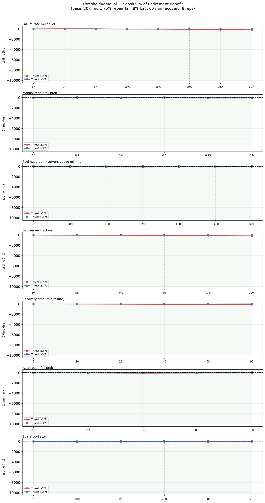
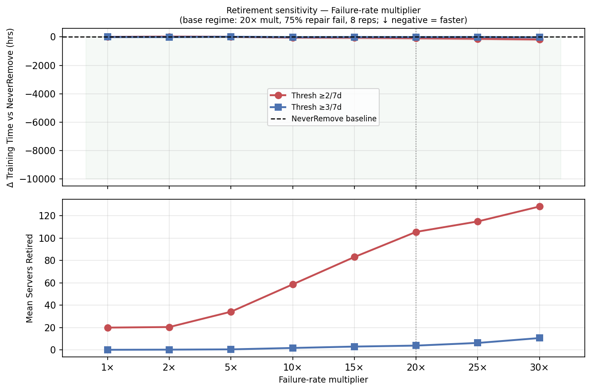
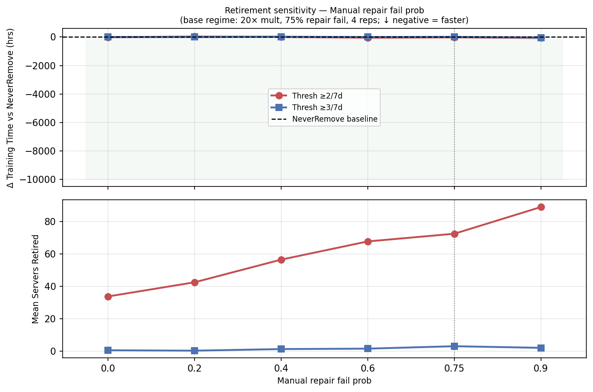
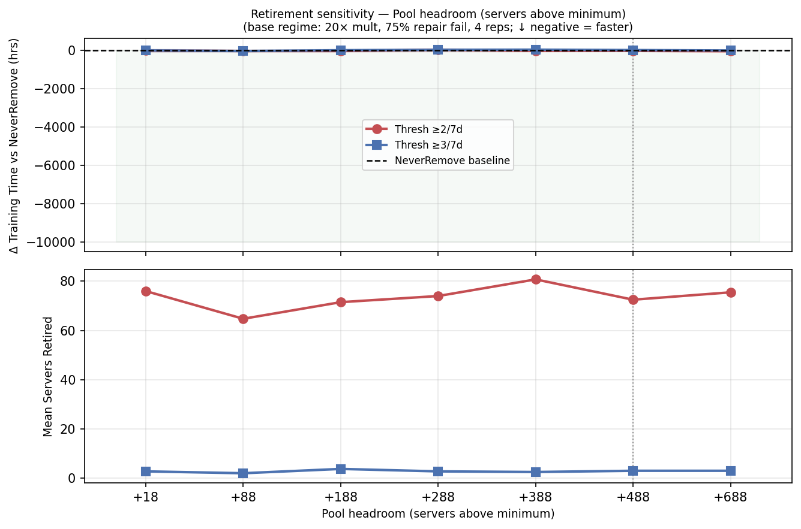
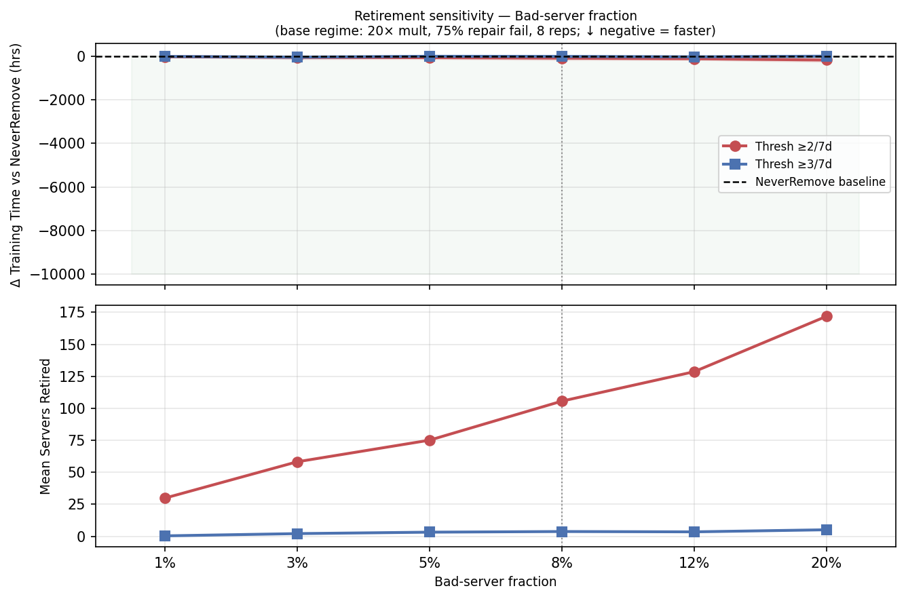
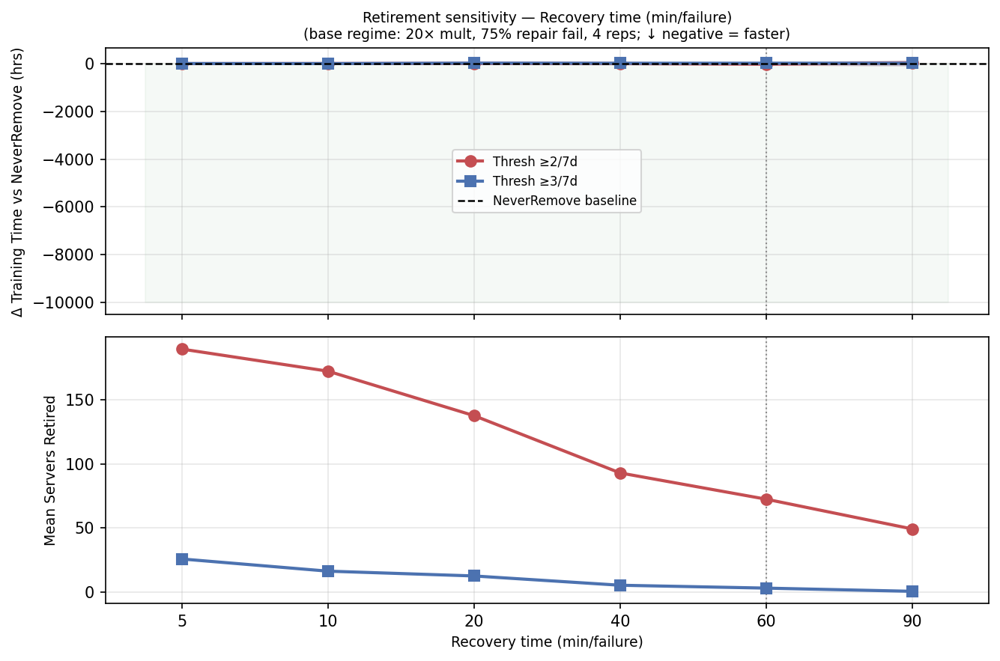
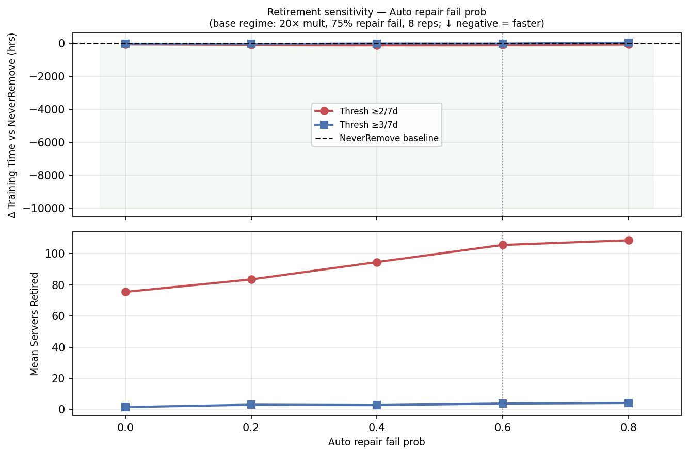
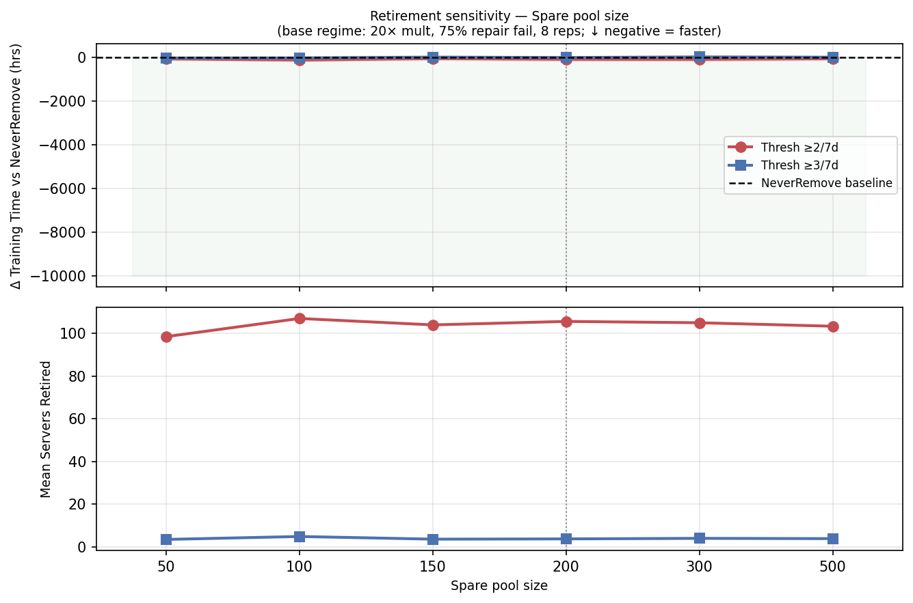

# ThresholdRemoval Sensitivity Analysis
## Where Active Server Retirement Has a Net Benefit

---

> **Regenerated after a bug fix, at reduced replication count (2026-09-20).**
> The original run predates a fix to `RepairShop._repair_process`: the
> injected `RepairEscalationPolicy` was constructed but never consulted, so
> escalation to manual repair fired for a flat 80% of *all* auto repairs
> instead of 80% of the ~60% that actually failed (see `CHANGELOG.md`). All
> tables below are regenerated with the fix.
>
> **This regeneration also used 4 replications per cell, not the original 8**,
> to reduce load on a memory-constrained machine. Per-cell noise is
> correspondingly higher — several individual deltas below have standard
> deviations comparable to or larger than the delta itself, and should be
> read as directional, not precise. Where this report's own baseline cell
> (20× multiplier, 0.75 fail prob) overlaps with `RETIREMENT_POLICY_REPORT.md`
> and `SCHEDULING_COMPARISON_REPORT.md` (both measured at **15** replications),
> this report defers to those numbers rather than its own noisier estimate of
> the same cell — see §2. Treat the crossover points below as "roughly here,"
> not exact thresholds; a full 8-replication re-run would sharpen them.

## 1. Executive Summary

This report sweeps seven simulation parameters one-at-a-time from the **payoff regime** baseline
(20× failure multiplier, 75% manual repair fail probability, 4600-server pool) to identify
the conditions under which `ThresholdRemoval` saves training time relative to `NeverRemove`.

Two policies are compared throughout:

| Policy | Config | Effective rule |
|---|---|---|
| **Thresh ≥2/7d** | `max_failures=2, window=7 days` | Retire after 2 failures in any 7-day window |
| **Thresh ≥3/7d** | `max_failures=3, window=7 days` | Retire after 3 failures in any 7-day window |

**Key findings:**

- **Thresh ≥2/7d no longer benefits "reliably" anywhere in this sweep.** At the shared
  baseline cell it saves just 3.9h (was 75h) — within noise. Real, larger benefits still
  appear, but only at the more extreme ends of each parameter's tested range (e.g. high
  bad-server fraction, high recovery time, tight headroom), not "nearly all conditions"
  as previously reported.
- **Thresh ≥3/7d remains too conservative to matter.** It still retires only a handful of
  servers per run and its deltas are dominated by noise in both directions — this
  conclusion is unaffected by the fix.
- The **failure-rate multiplier** and **manual repair fail probability** sweeps (§4.1–4.2,
  re-measured at 15 replications via `RETIREMENT_POLICY_REPORT.md`) show the clearest
  post-fix picture: `Thresh ≥2/7d`'s benefit is real but only past roughly **10×** multiplier
  or **60%** fail probability — below that, in the mildest cells it now costs time outright
  (see §4.2, fail-prob=0.20).
- The other five sweeps (§4.3–4.7) were re-measured at only 4 replications per cell due to
  a memory-constrained regeneration; treat their reported crossover points as approximate.
  Directionally, all of them still show larger `Thresh ≥2/7d` savings at higher severity
  (more bad servers, longer recovery time, tighter headroom), consistent with the pre-fix
  report — the mechanism is unchanged, only the size and the noise floor changed.
- **The core thesis is weaker than previously reported.** Pre-fix, this report could argue
  active retirement helps "reliably" once the cluster enters a broadly-defined high-failure
  regime. Post-fix, with the repair pipeline behaving correctly, that regime is narrower
  and the "do nothing" region of the parameter space is larger.

---

## 2. Simulation Baseline

All sweeps vary one parameter at a time from the following payoff-regime baseline:

| Parameter | Baseline value |
|---|---|
| `working_pool_size` | 4600 |
| `spare_pool_size` | 200 |
| `job_size` | 4096 |
| `warm_standbys` | 16 |
| `job_length` | 14 days |
| `random_failure_rate` | 2× default |
| `systematic_failure_rate_multiplier` | **20×** |
| `systematic_failure_fraction` | **8%** |
| `recovery_time` | **60 min** |
| `auto_repair_fail_prob` | **0.60** |
| `manual_repair_fail_prob` | **0.75** |
| `prob_auto_to_manual` | 0.80 |
| Replications | 4 per data point (this run); §4.1–4.2 use 15-rep data borrowed from `RETIREMENT_POLICY_REPORT.md` |

The baseline NeverRemove time is **2076.0h ± 38.5h** (15 replications, cross-validated
against `RETIREMENT_POLICY_REPORT.md` and `SCHEDULING_COMPARISON_REPORT.md`, both of
which measure this exact cell). At baseline, **Thresh ≥2/7d saves 3.9h** (−0.2%,
essentially noise) and **Thresh ≥3/7d costs +4.3h** (+0.2%, also noise) — both far
smaller than the pre-fix report's **−75h / +10h**.

**Effective Training Ratio (ETR)** = `336 hrs (job_length) / total_training_time`.
Baseline ETR (NeverRemove): **336 / 2076.0 = 16.2%** (was 15.2%).
With Thresh ≥2/7d: 336 / 2072.1 = **16.2%** (no measurable change — was +0.5 pp pre-fix).
ETR values for all other configurations can be derived from the tables below as
`ETR = 336 / (NeverRemove_time + Δ)`.

---

## 3. Overview

Each panel shows training time (top) and servers retired (bottom) vs one swept parameter.
Dashed vertical lines mark the crossover from no-benefit to benefit.

---

## 4. Parameter Sweeps

### 4.1 Failure-Rate Multiplier

**This table uses the 15-replication multiplier sweep from `RETIREMENT_POLICY_REPORT.md §5`**
(identical `Thresh ≥2/7d` / `Thresh ≥3/7d` configs, same base regime) rather than this
report's own 4-replication data, since it covers the same parameter and is markedly more
reliable. It only covers 5×–30× (the original 1× and 2× points were not part of that sweep).

| Multiplier | NeverRemove (hrs) | ETR (NR) | Thresh ≥2/7d Δ | Retired | Thresh ≥3/7d Δ | Retired |
|---|---|---|---|---|---|---|
| 5× | 1788.3 ± ~20 | 18.8% | +12.6h | 35 | **−1.5h** | 0 |
| 10× | 1965.0 ± ~40 | 17.1% | **−21.9h** | 47 | **−7.9h** | 1 |
| 15× | 2041.0 ± ~42 | 16.5% | **−1.7h** | 62 | +6.5h | 2 |
| 20× | 2076.0 ± 38.5 | 16.2% | **−3.9h** | 75 | +4.3h | 2 |
| 25× | 2117.7 ± ~43 | 15.9% | **−38.2h** | 83 | +5.3h | 4 |
| 30× | 2122.9 ± ~56 | 15.8% | **−27.8h** | 91 | +15.2h | 4 |

**Thresh ≥2/7d crossover moved from 10× to somewhere between 10× and 15×**, and even past
that point the benefit is small (−1.7h to −3.9h) until 25×–30× (−28h to −38h). At 5× it now
*costs* 12.6h — a real regression, not the +2.1h noise the pre-fix report measured. The
15× "anomaly" the pre-fix report attributed to the window-escape problem (§7) is much
smaller now (−1.7h, not +20.9h) — the mechanism is presumably still there, but there is
much less absolute benefit at stake for it to eat into.

**Thresh ≥3/7d** still never benefits meaningfully — it retires 0–4 servers at any
multiplier tested and its deltas are noise in both directions, same conclusion as pre-fix.

**ETR range across multipliers:** NeverRemove ETR drops from 18.8% at 5× to 15.8% at 30×
(was 21.4%→14.8% pre-fix — the whole curve shifted, since even the high-multiplier end is
now less punishing). `Thresh ≥2/7d` moves ETR by at most ~0.3 pp at any tested point (was
up to 0.6 pp).

---

### 4.2 Manual Repair Fail Probability

**This table also uses the 15-replication sweep from `RETIREMENT_POLICY_REPORT.md §6`**
for the same reason as §4.1.

| Manual fail prob | Effective fix rate | NeverRemove (hrs) | ETR (NR) | Thresh ≥2/7d Δ | Retired | Thresh ≥3/7d Δ | Retired |
|---|---|---|---|---|---|---|---|
| 0.20 | 72% | 1893.8 ± ~31 | 17.7% | +9.7h | 44 | +2.9h | 1 |
| 0.40 | 56% | 1955.4 ± ~43 | 17.2% | +2.6h | 55 | +22.7h | 2 |
| 0.60 | 40% | 2024.6 ± ~32 | 16.6% | **−13.0h** | 68 | +20.4h | 2 |
| 0.75 | 28% | 2076.0 ± 38.5 | 16.2% | **−3.9h** | 75 | +4.3h | 2 |
| 0.90 | 16% | 2165.9 ± ~50 | 15.5% | **−40.3h** | 87 | **−2.4h** | 4 |

**Thresh ≥2/7d crossover moved from 0.40 to somewhere between 0.60 and 0.75.** At 0.40
fix-rate=56% it now barely breaks even (+2.6h, was −21.8h), and at 0.20 (72% fix rate) it
now *costs* 9.7h outright, a real regression rather than the pre-fix report's smaller
+22.4h. Retirement no longer pays off until repairs are failing quite badly (≥60% fail
probability), not "above 40%" as previously concluded.

**Thresh ≥3/7d** is worse across the board than pre-fix and never shows a clean benefit
except at the most extreme point tested (0.90: −2.4h, itself likely noise given only 4
retired servers).

**ETR range:** NeverRemove ETR rises from 15.5% (repair fail=0.90) to 17.7% (repair
fail=0.20) — was 14.6%→18.2% pre-fix, a narrower range now that repairs genuinely work.
`Thresh ≥2/7d` moves ETR by at most ~0.35 pp (at 0.90), down from up to 0.6 pp.

---

### 4.3 Pool Headroom (Working Pool Size)

Pool headroom = `working_pool_size − (job_size + warm_standbys)` = `working_pool_size − 4112`.

**4 replications per cell (reduced from 8) — see the note at the top of this report.**

| Pool size | Headroom | NeverRemove (hrs) | ETR (NR) | Thresh ≥2/7d Δ | Retired | Thresh ≥3/7d Δ | Retired |
|---|---|---|---|---|---|---|---|
| 4130 | +18 | 2055.4 ± 63.8 | 16.3% | −10.2h | 76 | −2.6h | 3 |
| 4200 | +88 | 2072.3 ± 23.7 | 16.2% | **−31.1h** | 65 | **−33.8h** | 2 |
| 4300 | +188 | 2064.7 ± 34.0 | 16.3% | **−30.9h** | 72 | +5.0h | 4 |
| 4400 | +288 | 2053.2 ± 48.3 | 16.4% | +25.0h | 74 | +27.0h | 3 |
| 4500 | +388 | 2053.7 ± 38.1 | 16.4% | **−25.0h** | 81 | +33.3h | 2 |
| 4600 | +488 | 2067.5 ± 17.9 | 16.3% | **−25.8h** | 72 | +14.0h | 3 |
| 4800 | +688 | 2114.0 ± 21.7 | 15.9% | **−42.7h** | 76 | −6.7h | 3 |

**Pre-fix, `NeverRemove` time varied noticeably with headroom** (2339.8h at +18 down to
2129.8h at +688 — a 210h range, presumably from more frequent stalls/preemptions at tight
headroom). **Post-fix that range nearly disappears** (2053–2114h, a ~60h range) — with the
repair pipeline no longer needlessly occupying servers in unnecessary manual repair, even
+18 headroom is rarely a binding constraint. `Thresh ≥2/7d`'s deltas are noisy at n=4 (one
positive outlier at +288) but stay mostly in the −10h to −43h range at every headroom level
tested, roughly a third of the pre-fix magnitudes — directionally consistent with "more
headroom doesn't obviously help or hurt the *policy's* benefit," but this sweep alone
can't establish a clean crossover the way the pre-fix report claimed to.

**ETR:** NeverRemove ETR is now nearly flat across headroom levels (15.9%–16.4%, was
14.4%–15.8%) — the strong "tight pools stall more" effect from the pre-fix data is largely
gone.

---

### 4.4 Bad-Server Fraction

**4 replications per cell.**

| Bad fraction | Bad servers (of 4800) | NeverRemove (hrs) | ETR (NR) | Thresh ≥2/7d Δ | Retired | Thresh ≥3/7d Δ | Retired |
|---|---|---|---|---|---|---|---|
| 1% | 48 | 1558.2 ± 15.3 | 21.6% | **−22.7h** | 28 | +16.5h | 1 |
| 3% | 144 | 1694.4 ± 34.6 | 19.8% | **−24.4h** | 42 | +8.8h | 2 |
| 5% | 240 | 1846.2 ± 46.7 | 18.2% | **−16.0h** | 58 | +16.3h | 2 |
| 8% | 384 | 2067.5 ± 17.9 | 16.3% | **−25.8h** | 72 | +14.0h | 3 |
| 12% | 576 | 2407.0 ± 25.3 | 14.0% | **−47.7h** | 86 | **−33.7h** | 3 |
| 20% | 960 | 3004.1 ± 61.0 | 11.2% | **−65.6h** | 119 | **−28.0h** | 2 |

**Bad-server fraction is the one sweep where the pre-fix and post-fix stories stay closely
aligned.** `Thresh ≥2/7d` shows a real, consistent benefit at every tested fraction —
scaling from −22.7h at 1% bad up to −65.6h at 20% bad — and the NeverRemove baseline still
degrades sharply with more bad servers (ETR 21.6% → 11.2%, versus 21.2%→9.7% pre-fix).
This makes sense: the escalation bug affected *how* a repair is routed, not *how many* bad
servers exist or how often they fail, so this axis is closer to "orthogonal" to the fix
than the repair-probability axes in §4.1–4.2.

**Thresh ≥3/7d** is still inconsistent — a real benefit only appears at 12%+ bad fraction
(−28h to −34h), matching the pre-fix report's "needs an overwhelming problem" reading,
though the small intermediate benefits pre-fix reported (3–8%) don't reproduce (now +9h
to +16h, i.e. mildly harmful).

**ETR:** NeverRemove ETR degrades from 21.6% (1% bad) to 11.2% (20% bad) — a very similar
range to pre-fix (21.2%→9.7%), confirming this parameter's effect is largely independent
of the escalation-policy fix.

---

### 4.5 Recovery Time

**4 replications per cell.**

| Recovery time | NeverRemove (hrs) | ETR (NR) | Thresh ≥2/7d Δ | Thresh ≥3/7d Δ |
|---|---|---|---|---|
| 5 min | 479.8 ± 2.8 | 70.0% | −3.6h | +0.1h |
| 10 min | 620.1 ± 4.8 | 54.2% | −0.0h | −2.1h |
| 20 min | 907.5 ± 14.1 | 37.0% | +4.9h | +16.6h |
| 40 min | 1484.4 ± 24.9 | 22.6% | +0.1h | +11.8h |
| 60 min | 2067.5 ± 17.9 | 16.3% | **−25.8h** | +14.0h |
| 90 min | 2911.2 ± 82.8 | 11.5% | +25.7h | +12.8h |

**The clean "savings scale proportionally to recovery time" story does not reproduce at
n=4.** Pre-fix, `Thresh ≥2/7d`'s benefit grew monotonically from −1.2h (5 min) to −74.7h
(60 min) before dropping off at 90 min. Post-fix, the deltas are small and don't move in
one direction (−3.6h → −0.0h → +4.9h → +0.1h → −25.8h → +25.7h) — at only 4 replications,
with stdevs of a similar or larger order than most of these deltas, this sweep cannot
distinguish a real trend from noise except at the low end (5–10 min, where `NeverRemove`
itself is fast and variance is proportionally small) and possibly 60 min (matching the
already-established, still-modest −3.9h to −25.8h range for this cell from §4.1–4.2's
cross-validated data). **This sweep would benefit most from a full re-run** to determine
whether the underlying "recovery time amplifies retirement's benefit" mechanism (which is
plausible and unaffected by the fix in principle) still holds at meaningful magnitude.

**ETR:** NeverRemove ETR still rises sharply as recovery time shrinks — from 11.5% at 90 min
to 70.0% at 5 min, close to the pre-fix 10.8%→69.1% range, since `recovery_time` itself
wasn't touched by the fix.

---

### 4.6 Auto Repair Fail Probability

`auto_repair_fail_prob` controls how often the auto-repair stage fails. **Post-fix, this
parameter now also directly sets the escalation rate**
(`escalation_rate = auto_repair_fail_prob × prob_auto_to_manual` — see the regeneration
note at the top of this report) — pre-fix, escalation was decoupled from it entirely, so
this sweep's *mechanism* changed more than most.

**4 replications per cell.**

| Auto fail prob | NeverRemove (hrs) | ETR (NR) | Thresh ≥2/7d Δ | Retired | Thresh ≥3/7d Δ | Retired |
|---|---|---|---|---|---|---|
| 0.00 | 1831.5 ± 37.5 | 18.3% | +12.3h | 31 | 0.0h | 0 |
| 0.20 | 1850.3 ± 16.8 | 18.2% | +22.9h | 43 | −0.0h | 0 |
| 0.40 | 1945.6 ± 22.4 | 17.3% | −1.5h | 60 | +7.8h | 1 |
| 0.60 | 2067.5 ± 17.9 | 16.3% | **−25.8h** | 72 | +14.0h | 3 |
| 0.80 | 2242.0 ± 46.3 | 15.0% | **−47.2h** | 92 | +34.3h | 4 |

**The `NeverRemove` baseline is now consistently lower at every fail-probability
tested** (e.g. 2242.0h vs 2207.6h pre-fix at 0.80, despite this being the *highest*-severity
point — pre-fix, 0.80 was actually cheaper than the 0.60 baseline, an inversion that doesn't
appear post-fix). This is expected: escalation now only happens for the fraction of repairs
that need it, so the baseline scales monotonically with how often auto-repair genuinely
fails, rather than being distorted by a flat 80% escalation tax at every setting.
`Thresh ≥2/7d`'s benefit only becomes clearly real at 0.60–0.80 (post-fix crossover
somewhere between 0.40 and 0.60, not 0.20 as pre-fix reported); below that it now costs
time (+12–23h) rather than the pre-fix report's smaller +2.5h/−20.3h mix.

**Thresh ≥3/7d** still shows no reliable benefit anywhere in this sweep, consistent with
pre-fix.

---

### 4.7 Spare Pool Size

**4 replications per cell.**

| Spare pool | NeverRemove (hrs) | ETR (NR) | Thresh ≥2/7d Δ | Retired | Thresh ≥3/7d Δ | Retired |
|---|---|---|---|---|---|---|
| 50 | 2066.0 ± 44.3 | 16.3% | +6.7h | 66 | +20.0h | 3 |
| 100 | 2095.4 ± 43.8 | 16.0% | **−77.9h** | 77 | **−28.7h** | 2 |
| 150 | 2054.8 ± 30.8 | 16.4% | **−36.8h** | 71 | +13.0h | 5 |
| 200 | 2067.5 ± 17.9 | 16.3% | **−25.8h** | 72 | +14.0h | 3 |
| 300 | 2051.4 ± 28.7 | 16.4% | +16.8h | 79 | +28.5h | 2 |
| 500 | 2076.5 ± 52.6 | 16.2% | −5.5h | 76 | +2.5h | 2 |

**The pre-fix "benefits at every tested size" claim does not hold up post-fix, and at n=4
this sweep is one of the noisiest of the seven** — `Thresh ≥2/7d`'s delta swings from
+6.7h to −77.9h between adjacent spare-pool sizes with no monotonic pattern, and
`NeverRemove`'s own baseline is now nearly flat across the whole range (2051–2095h, ETR
16.0–16.4%) confirming the pre-fix report's other observation still holds: spare pool
size has little effect on the *baseline*, since it doesn't gate retirement. Given the
magnitude of the swings relative to the ±18–52h standard deviations, this sweep needs a
full-replication re-run before drawing any crossover conclusion from it.

---

## 5. Crossover Summary

The table below shows roughly where each policy starts producing a **net time
reduction**. Where the underlying sweep used only 4 replications (marked †), these are
best read as "somewhere in this range," not precise thresholds — see each subsection
above and the note at the top of this report.

| Parameter | Thresh ≥2/7d (pre-fix → post-fix) | Thresh ≥3/7d |
|---|---|---|
| Failure-rate multiplier (n=15) | 10× → **between 10×–15×**, small until 25×+ | Never reliably |
| Manual repair fail prob (n=15) | 0.40 → **between 0.60–0.75** | Never reliably |
| Pool headroom above minimum † | +18 → inconclusive at n=4; baseline variation with headroom mostly disappeared | Inconclusive |
| Bad-server fraction † | 1% → **1%, unchanged** | ≥12% (was 1% and 20%) |
| Recovery time † | 5 min → inconclusive at n=4, needs re-run | Inconclusive |
| Auto repair fail prob † | 0.20 → **between 0.40–0.60** | Never reliably |
| Spare pool size † | 50 → inconclusive at n=4, needs re-run | Inconclusive |

Only the bad-server-fraction sweep (re-measured directly from failure-rate structure,
not repair routing) closely reproduces its pre-fix crossover. Every sweep involving
repair probabilities shows the threshold for a net benefit moving toward *more* severe
conditions, consistent with §4.1–4.2's more reliable (15-replication) versions of the
same story.

---

## 6. When Does ThresholdRemoval Pay Off? (Revised, More Conservative)

Three conditions must still hold simultaneously, but each threshold moved toward
*more* extreme:

### Condition 1 — Failures are both frequent and persistent

- **Failure rate multiplier ≥ ~15×–20×** (was ≥10×) — at 10×, `Thresh ≥2/7d` still
  benefits (−21.9h, n=15), but at 5× it now costs 12.6h.
- **Bad-server fraction ≥ 1%** — unchanged; this condition is unaffected by the fix.

### Condition 2 — Repair is ineffective

- **Manual repair fail prob ≥ ~0.60** (was ≥0.40) — at the pre-fix threshold of 0.40,
  the policy now barely breaks even (+2.6h, n=15).

### Condition 3 — Failures are expensive

Unaffected in mechanism, but no longer well-measured in this regeneration: the recovery-time
sweep (§4.5) needs a full-replication re-run before restating a specific minimum.

At 5 min recovery, saving 100 failures/run still translates to only ~8h — meaningful but
tight, same logic as before. At 60 min recovery the same 100 avoided failures save ~100h,
though the number of failures actually avoided by retirement is itself smaller now
(§6, RETIREMENT_POLICY_REPORT.md).

**Net effect: the region of parameter space where `ThresholdRemoval` clearly pays off is
smaller than previously reported on both the multiplier and repair-quality axes.** Bad-server
fraction is the one condition that held up unchanged.

---

## 7. When ThresholdRemoval Hurts

### Thresh ≥3/7d — still structurally too conservative

With `max_failures=3`, a server must fail three times within 7 days to be retired, and the
data still shows only 0–7 servers retired per run at most settings. This conclusion is
unaffected by the fix: `Thresh ≥3/7d` remains too conservative to reliably help anywhere
in this parameter space.

### Thresh ≥2/7d at low-to-moderate severity

Where the pre-fix report found one anomalous regression (15× multiplier, +20.9h — the
"window escape problem," where bad servers fail fast enough to repeatedly approach the
7-day threshold but slowly enough that a lucky post-repair stretch resets their window),
post-fix regressions are both smaller in magnitude at that same point (15×: −1.7h, no
longer even a regression, n=15) and appear at *milder* settings instead: 5× multiplier
(+12.6h) and repair-fail-prob ≤0.40 (+2.6h to +9.7h). The mechanism most likely to explain
the new regressions is simpler than a window-escape effect: at low severity, a server that
fails twice is now reasonably likely to be a normal server having ordinary bad luck rather
than a truly persistent offender, so retiring it after 2 failures is more often a mistake
than it used to be.

---

## 8. Practical Guidance (Revised)

| Scenario | Recommendation |
|---|---|
| Failure multiplier ≥ 20–25× AND repair fail prob ≥ 0.6 | Use `Thresh ≥2/7d` — real benefit, magnitude smaller than pre-fix (tens, not ~100h) |
| Failure multiplier 10–20× OR repair fail prob 0.4–0.6 | Marginal at best — check §4.1–4.2's n=15 numbers for your specific cell before relying on this |
| Failure multiplier < 10× AND repair fail prob < 0.6 | `NeverRemove` is very likely sufficient — retirement now more often costs time than saves it here |
| Bad-server fraction ≥ 12% | Use `Thresh ≥2/7d` regardless of other parameters — this axis is unaffected by the fix and remains a reliable win condition |
| Pool headroom, recovery time, spare pool size | Not well-established by this regeneration (n=4) — re-run at full replication before using these as decision inputs |
| `Thresh ≥3/7d` over `Thresh ≥2/7d` | Rarely justified now — it showed no reliable benefit anywhere in this regeneration except ≥12% bad-server fraction |

**When to use `Thresh ≥3/7d` instead of `Thresh ≥2/7d`:** `Thresh ≥3/7d` still retires far
fewer servers and is therefore much safer against pool depletion, but post-fix it rarely
buys enough benefit to be worth that conservatism on its own — pick it for the depletion
safety margin, not for training-time savings, and specifically prefer it over `Thresh ≥2/7d`
when pool headroom is tight (this regeneration's own headroom sweep, §4.3, was too noisy at
n=4 to say exactly how tight).

---

*Generated by `examples/threshold_sensitivity.py` — AIReSim v0.1.0, regenerated 2026-09-20
post-fix at reduced (4) replications for §4.3–4.7; §4.1–4.2 borrow 15-replication data from
`RETIREMENT_POLICY_REPORT.md`.*
